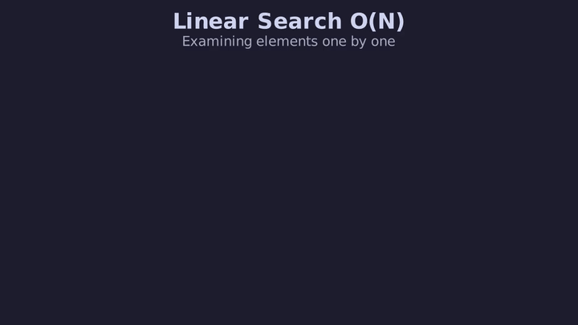
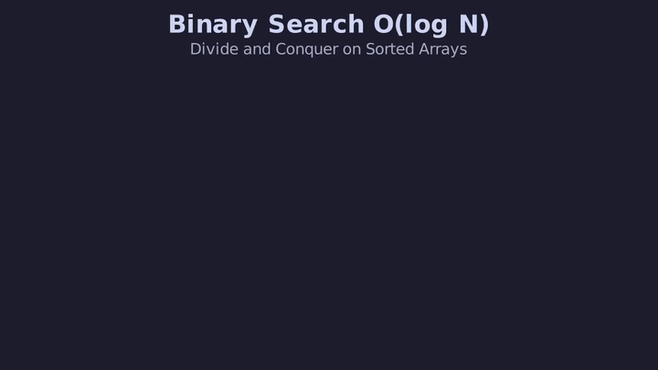
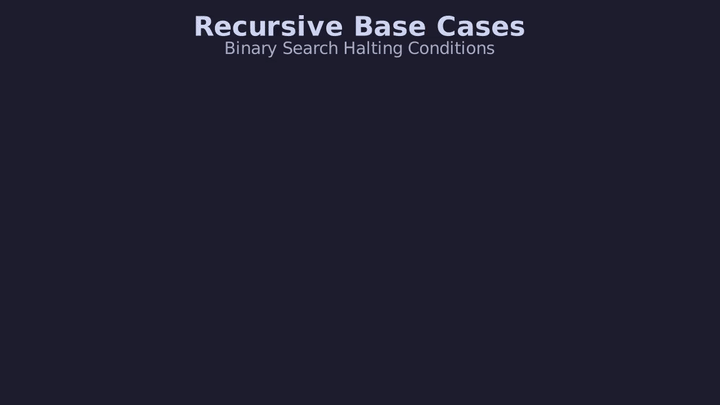
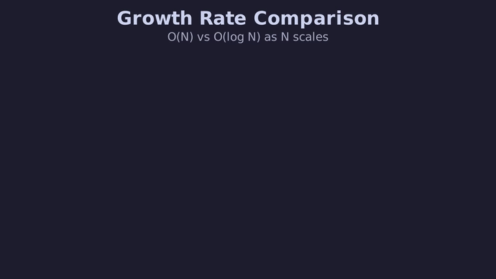

# L35 — Búsqueda Lineal y Binaria: Algoritmos, Complejidad e Implementación

> [!NOTE]
> **Fundamentación Académica:** Esta lección sintetiza los conceptos del **Capítulo 7 (*Introduction to Recursion*, pp. 315–348)** y **Capítulo 10 (*Algorithmic Analysis*, pp. 429–478)** del libro oficial de Stanford CS106B (*Programming Abstractions in C++* por Eric Roberts), cubriendo **7.5** *The binary search algorithm* (p. 335) y **10.2** *Computational complexity* (p. 435).
>
> *"When you look for a word in a dictionary, you don't start at the first page."*
> — CS106B, Sec. 7.5

---

## 🧭 Navegación Rápida

- 📄 **Lecturas Académicas Base:**
  - 🌲 [Stanford CS106B Textbook — Ch 7.5 (p. 335) & Ch 10.2 (p. 435)](https://web.stanford.edu/class/cs106x/res/reader/CS106BX-Reader.pdf)
- 💻 **Laboratorio de Código:** [`L35_LinearBinarySearch.cpp`](../code/L35_LinearBinarySearch.cpp)

---

## Objetivos de Aprendizaje

- [ ] Entender el funcionamiento y limitaciones de la **Búsqueda Lineal ( $O(N)$ )** en arreglos desordenados (Sección 10.2).
- [ ] Dominar la **Búsqueda Binaria ( $O(\log N)$ )** en arreglos previamente **ordenados** (Sección 7.5).
- [ ] Implementar versiones **iterativas** y **recursivas** de la Búsqueda Binaria.
- [ ] Prevenir el error clásico de desbordamiento entero en el cálculo del punto medio: `mid = low + (high - low) / 2`.
- [ ] Analizar por qué $\log_2(1{,}000{,}000) \approx 20$ comparaciones frente a $1{,}000{,}000$ comparaciones lineales.

---

## 1. Búsqueda Lineal (*Linear Search* — Sección 10.2)

La **Búsqueda Lineal** examina cada elemento del arreglo uno por uno desde el índice `0` hasta encontrar el elemento buscado o agotar la secuencia.

- **Requisito:** Ninguno. Funciona en arreglos tanto **desordenados** como ordenados.
- **Complejidad Temporal:**
  - **Mejor Caso:** $O(1)$ — el elemento está en `arr[0]`.
  - **Peor Caso:** $O(N)$ — el elemento está al final o no existe.
  - **Caso Promedio:** $O(N)$ — $\approx N/2$ comparaciones.

```cpp
int busquedaLineal(const int arr[], int size, int target) {
    for (int i = 0; i < size; i++) {
        if (arr[i] == target) return i; // Encontrado
    }
    return -1; // No encontrado
}
```

### Visualización de la Búsqueda Lineal



---

## 2. Búsqueda Binaria (*Binary Search* — Sección 7.5)

> [!TIP]
> **La Analogía del Diccionario (Sec. 7.5):**
> Cuando buscas una palabra en un diccionario de 1,000 páginas, no hojeas página por página desde la primera. Abres el libro justo en la mitad. Yes la palabra buscada es alfabéticamente menor, descartas toda la mitad derecha y repites el proceso en la mitad izquierda.

> [!IMPORTANT]
> **Prerrequisito Fundamental:** La Búsqueda Binaria **REQUIERE** que el arreglo esté **estrictamente ORDENADO**. Sin este prerrequisito, el algoritmo puede dar resultados incorrectos.

### Estrategia Divide y Vencerás

<div align="center">
  
</div>

Los 4 pasos del algoritmo:
1. Calcular el punto medio `mid = low + (high - low) / 2`.
2. Si `arr[mid] == target` → elemento encontrado, retornar `mid`.
3. Si `target < arr[mid]` → buscar recursivamente en la mitad **izquierda** (`low` a `mid - 1`).
4. Si `target > arr[mid]` → buscar recursivamente en la mitad **derecha** (`mid + 1` a `high`).

---

## 3. Los Dos Casos Base de la Búsqueda Binaria Recursiva



---

## 4. Implementación Recursiva e Iterativa en C++

### 🛠️ Implementación Recursiva (Sección 7.5)

```cpp
int busquedaBinariaRecursiva(const int arr[], int low, int high, int target) {
    // CASO BASE 1: Rango exhausto → elemento no existe en el arreglo
    if (low > high) return -1;

    // Prevención de overflow entero (ver Sección 5 abajo)
    int mid = low + (high - low) / 2;

    // CASO BASE 2: Elemento encontrado exactamente en mid
    if (arr[mid] == target) return mid;

    // PASO RECURSIVO: Reducir búsqueda a la mitad correspondiente
    if (arr[mid] > target)
        return busquedaBinariaRecursiva(arr, low, mid - 1, target); // Mitad izquierda
    else
        return busquedaBinariaRecursiva(arr, mid + 1, high, target); // Mitad derecha
}
```

### 🛠️ Implementación Iterativa (`O(1)` espacio en pila)

```cpp
int busquedaBinariaIterativa(const int arr[], int size, int target) {
    int low = 0;
    int high = size - 1;

    while (low <= high) {
        int mid = low + (high - low) / 2; // Seguro contra overflow

        if (arr[mid] == target) return mid;    // Encontrado
        if (arr[mid] < target)  low = mid + 1; // Buscar a la derecha
        else                    high = mid - 1; // Buscar a la izquierda
    }
    return -1; // No encontrado
}
```

---

## 5. Detalle Crítico de Ingeniería: Prevención de Integer Overflow

> [!CAUTION]
> **El Bug de Josh Bloch (2006) — Java SDK Binary Search:**
> La fórmula tradicional `int mid = (low + high) / 2;` tiene un error sutil. En arreglos masivos donde `low + high > 2,147,483,647` (límite de `int` de 32-bit signed), la suma sufre un **Overflow Entero** produciendo un número negativo y causando un crash o resultado incorrecto.
>
> **La fórmula segura siempre:**
> ```math
> \text{mid} = \text{low} + \frac{\text{high} - \text{low}}{2}
> ```
> Dado que `high - low` nunca supera el rango del arreglo, la suma parcial nunca desborda.

---

## 6. Comparativa de Escalamiento Asintótico

| Tamaño del Arreglo ( $N$ ) | Búsqueda Lineal $O(N)$ | Búsqueda Binaria $O(\log_2 N)$ |
| :---: | :---: | :---: |
| **10** | 10 comparaciones | 4 comparaciones |
| **100** | 100 comparaciones | 7 comparaciones |
| **1,000** | 1,000 comparaciones | 10 comparaciones |
| **1,000,000** | 1,000,000 comparaciones | **20 comparaciones** |
| **1,000,000,000** | 1,000,000,000 comparaciones | **30 comparaciones** |



---

## ❓ Pregunta de Chequeo #1 — Máximo Número de Comparaciones

Para un arreglo ordenado de **$8{,}000{,}000$ elementos**, ¿cuál es el número máximo de comparaciones que realizará la Búsqueda Binaria?

<details>
<summary>🔍 <strong>Ver Explicación y Cálculo Logarítmico</strong></summary>

**Respuesta:** Máximo **23 comparaciones**.

**Cálculo:**
```math
\lceil \log_2(8{,}000{,}000) \rceil = \lceil 22.93 \rceil = 23
```

Esto contrasta con los $8{,}000{,}000$ de pasos que requeriría la búsqueda lineal en el peor caso.

</details>

---

## ❓ Pregunta de Chequeo #2 — ¿Qué pasa si el arreglo NO está ordenado?

¿Qué retornaría `busquedaBinariaRecursiva` sobre `{5, 1, 8, 3, 9}` buscando el `3`?

<details>
<summary>🔍 <strong>Ver Respuesta</strong></summary>

Retornaría `-1` (no encontrado), aunque `3` sí existe en el arreglo. El algoritmo comparará `arr[mid]=8` con `3`, buscará en la mitad izquierda `{5, 1}`, y nunca llegará al `3` que está en la posición 3. **La Búsqueda Binaria es incorrecta sobre datos no ordenados.**

</details>

---

## 📝 Resumen de L35

1. **Búsqueda Lineal:** $O(N)$ peor caso. Funciona sobre cualquier arreglo — sin requisitos de orden.
2. **Búsqueda Binaria:** $O(\log N)$ peor caso. **Exige datos estrictamente ordenados** como prerrequisito.
3. **Punto Medio Seguro:** Usar siempre `mid = low + (high - low) / 2` — la fórmula `(low+high)/2` puede desbordarse.
4. **Dos Casos Base:** `low > high` (no encontrado) y `arr[mid] == target` (encontrado).
5. **Impacto práctico:** Para $N = 10^9$, la diferencia es **1,000,000,000 vs 30** operaciones.

---

<div align="center">

### 🧭 Navegación y Progresión

| ⬅️ Lección Anterior | 🏠 Inicio de Sección | ➡️ Siguiente Lección |
|:------------------:|:-------------------:|:------------------:|
| [**⬅️ L34 — Notación Big-O**](L34_BigONotation.md) | [**🏠 Recursión y Algoritmos**](../README.md) | [**L36 — Ordenamientos Cuadráticos ➡️**](L36_QuadraticSorts.md) |

</div>

---

<div align="center">
  <sub>Maintained by <strong>MiniLux0</strong> · 2026</sub>
</div>