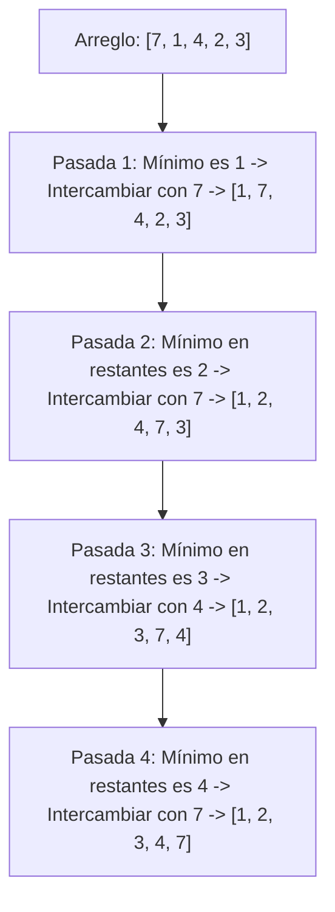

<div align="center">

| ⬅️ Previous Lesson | 🏠 Section Home | ➡️ Next Lesson |
|:------------------:|:--------------:|:--------------:|
| [**⬅️ L34 — Linear & Binary Search**](L34_LinearBinarySearch.md) | [**🏠 Recursion & Algorithms**](../README.md) | [**L36 — MergeSort ➡️**](L36_MergeSort.md) |

</div>

---

# L35 — Algoritmos de Ordenamiento Cuadráticos: Selección, Inserción y Burbuja

> [!NOTE]
> **Fundamentación Académica:** Esta lección sintetiza los conceptos del **Capítulo 10.3 (*Sorting Algorithms*)** del libro oficial de Stanford CS106B ([`CS106BX-Reader.pdf`](../../files/cs106b/textbook/CS106BX-Reader.pdf)) y **Stanford CS106X Handouts**.

---

## 🧭 Navegación Rápida

- 📄 **Lecturas Académicas Base:**
  - 🌲 [Stanford CS106B Textbook (Ch 10.3, pp. 451–460)](../../files/cs106b/textbook/CS106BX-Reader.pdf)
  - ⚡ [Stanford CS106X — Sorting Efficiency & In-Place Algorithms](../../files/cs106x/README.md)
- 💻 **Laboratorio de Código:** [`L35_QuadraticSorts.cpp`](../code/L35_QuadraticSorts.cpp)

---

## Objetivos de Aprendizaje

- [ ] Comprender la familia de algoritmos de ordenamiento cuadráticos ($O(N^2)$).
- [ ] Dominar el algoritmo **Selection Sort (Ordenamiento por Selección)**.
- [ ] Dominar el algoritmo **Insertion Sort (Ordenamiento por Inserción)** y entender por qué supera a los demás en datos casi ordenados.
- [ ] Dominar el algoritmo **Bubble Sort (Ordenamiento por Burbuja)** y su bandera de optimización.
- [ ] Analizar la diferencia entre algoritmos **estables** e **in-place**.

---

## 1. Selección (*Selection Sort*)

**Idea Central:** Encuentra de forma iterativa el **elemento mínimo** en la parte no ordenada del arreglo y lo intercambia con el primer elemento no ordenado.



### Implementación C++:
```cpp
void selectionSort(int arr[], int n) {
    for (int i = 0; i < n - 1; i++) {
        int minIdx = i;
        for (int j = i + 1; j < n; j++) {
            if (arr[j] < arr[minIdx]) {
                minIdx = j;
            }
        }
        std::swap(arr[i], arr[minIdx]);
    }
}
```
- **Complejidad Temporal:** $O(N^2)$ en el mejor, promedio y peor caso (siempre realiza $\frac{N(N-1)}{2}$ comparaciones).
- **Complejidad Espacial:** $O(1)$ (In-place).

---

## 2. Inserción (*Insertion Sort*)

**Idea Central:** Similar a ordenar cartas en la mano. Toma cada elemento nuevo y lo **desplaza hacia la izquierda** e inserta en la posición correcta entre los elementos previamente ordenados.

> [!TIP]
> **Ventaja Práctica:** Si el arreglo ya está **casi ordenado**, Insertion Sort se ejecuta en **$O(N)$ lineal**, siendo extremadamente rápido en la práctica.

### Implementación C++:
```cpp
void insertionSort(int arr[], int n) {
    for (int i = 1; i < n; i++) {
        int key = arr[i];
        int j = i - 1;
        // Desplazar elementos mayores a key hacia la derecha
        while (j >= 0 && arr[j] > key) {
            arr[j + 1] = arr[j];
            j--;
        }
        arr[j + 1] = key;
    }
}
```

---

## 3. Burbuja (*Bubble Sort*) con Optimización de Parada

**Idea Central:** Compara pares adyacentes de elementos `(arr[j], arr[j+1])` y los intercambia si están desordenados, haciendo que los valores mayores "burbujeen" hacia el final del arreglo.

> [!IMPORTANT]
> **Optimización Early-Exit:** Si en una pasada completa no se realiza ningún intercambio (`swapped == false`), el arreglo ya está 100% ordenado y se interrumpe el bucle inmediatamente.

### Implementación C++:
```cpp
void bubbleSort(int arr[], int n) {
    for (int i = 0; i < n - 1; i++) {
        bool swapped = false;
        for (int j = 0; j < n - 1 - i; j++) {
            if (arr[j] > arr[j + 1]) {
                std::swap(arr[j], arr[j + 1]);
                swapped = true;
            }
        }
        if (!swapped) break; // Optimización de parada temprana
    }
}
```

---

## 4. Cuadro Comparativo de Algoritmos Cuadráticos

| Algoritmo | Peor Caso | Mejor Caso | Estabilidad | Memoria Extra | Mejor Uso |
| :--- | :---: | :---: | :---: | :---: | :--- |
| **Selection Sort** | $O(N^2)$ | $O(N^2)$ | Inestable | $O(1)$ | Cuando los intercambios de memoria son muy costosos. |
| **Insertion Sort** | $O(N^2)$ | **$O(N)$** | **Estable** | $O(1)$ | Arreglos pequeños ($N < 30$) o datos casi ordenados. |
| **Bubble Sort** | $O(N^2)$ | **$O(N)$** | **Estable** | $O(1)$ | Fines pedagógicos y comprobación de orden. |

---

## ❓ Pregunta de Chequeo #1 — Estabilidad en Algoritmos de Ordenamiento

**¿Qué significa que un algoritmo de ordenamiento sea ESTABLE?**

<details>
<summary>🔍 <strong>Ver Explicación</strong></summary>

> [!NOTE]
> **Definición de Estabilidad:** Un algoritmo de ordenamiento es **estable** si mantiene el orden relativo original de los elementos que poseen claves duplicadas o iguales.
> Por ejemplo, si tenemos una lista de estudiantes ordenada por nombre y luego la ordenamos de forma estable por nota, los estudiantes que tengan la misma nota mantendrán su orden alfabético relativo previo.

</details>

---

## 📝 Resumen Resumido de L35

1. Todos los algoritmos cuadráticos requieren $O(N^2)$ en el peor caso.
2. **Insertion Sort** es el más eficiente en la práctica para arreglos pequeños o casi ordenados.
3. Todos funcionan **In-Place** utilizando $O(1)$ memoria adicional.

---

## Archivos Relacionados

- 💻 [`L35_QuadraticSorts.cpp`](../code/L35_QuadraticSorts.cpp) — Código ejecutable con Selection, Insertion y Bubble Sort
- 📘 [`L36_MergeSort.md`](L36_MergeSort.md) — Siguiente lección: MergeSort $O(N \log N)$

---
*MiniLux0 — Learning C++ Section 05*
