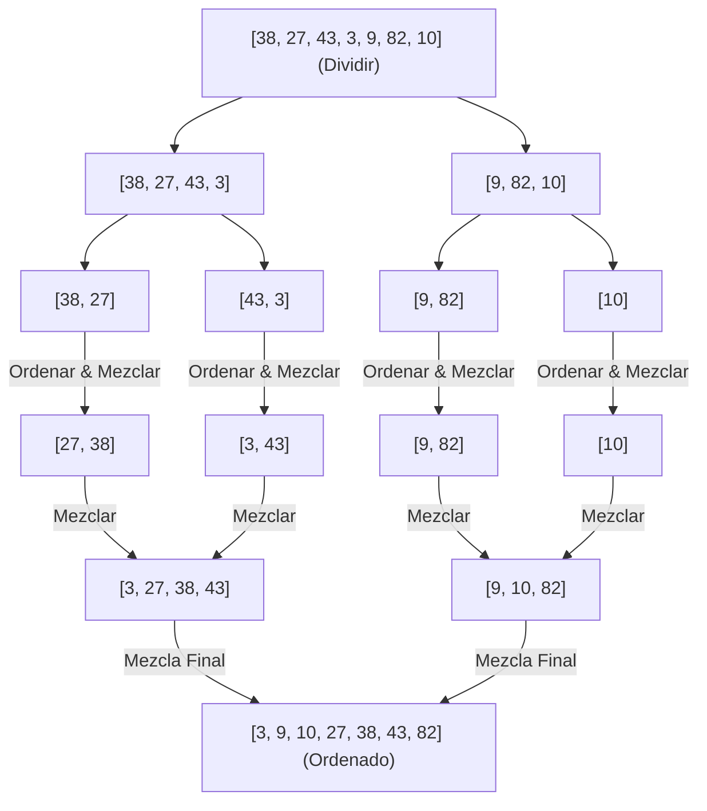

<div align="center">

| ⬅️ Previous Lesson | 🏠 Section Home | ➡️ Next Lesson |
|:------------------:|:--------------:|:--------------:|
| [**⬅️ L35: Quadratic Sorts**](L35_QuadraticSorts.md) | [**Section 05: Recursion & Algorithms**](../README.md) | [**L37: QuickSort ➡️**](L37_QuickSort.md) |

</div>

---

# L36 — MergeSort: Ordenamiento por Mezcla y la Estrategia Divide y Vencerás

> [!NOTE]
> **Fundamentación Académica:** Esta lección sintetiza los conceptos del **Capítulo 10.3 (*MergeSort*)** del libro oficial de Stanford CS106B ([`CS106BX-Reader.pdf`](../../files/cs106b/textbook/CS106BX-Reader.pdf)) y **Stanford CS106X Handouts**.

---

## 🧭 Navegación Rápida

- 📄 **Lecturas Académicas Base:**
  - 🌲 [Stanford CS106B Textbook (Ch 10.3, pp. 461–470)](../../files/cs106b/textbook/CS106BX-Reader.pdf)
  - ⚡ [Stanford CS106X — Divide and Conquer Paradigms](../../files/cs106x/README.md)
- 💻 **Laboratorio de Código:** [`L36_MergeSort.cpp`](../code/L36_MergeSort.cpp)

---

## Objetivos de Aprendizaje

- [ ] Dominar el paradigma de **Divide y Vencerás (*Divide and Conquer*)**.
- [ ] Entender la función auxiliar de combinación **`merge()`** para unir dos subarreglos ordenados.
- [ ] Demostrar por qué MergeSort garantiza una complejidad temporal de **$O(N \log N)$** en todos los casos.
- [ ] Analizar el costo de memoria de la **complejidad espacial $O(N)$**.

---

## 1. El Paradigma Divide y Vencerás

MergeSort divide el problema de ordenar un arreglo de tamaño $N$ en 3 pasos fundamentales:
1. **Dividir:** Divide el arreglo por la mitad en dos subarreglos de tamaño aproximadamente $\frac{N}{2}$.
2. **Vencer (Recursión):** Ordena recursivamente cada mitad llamando a `mergeSort` en cada una.
3. **Combinar (Mezclar):** Une (*merge*) los dos subarreglos ordenados en un único arreglo final totalmente ordenado.



---

## 2. La Función Clave: `merge()`

La función `merge(arr, left, mid, right)` combina dos subarreglos adyacentes previamente ordenados:
- Subarreglo izquierdo: `arr[left ... mid]`
- Subarreglo derecho: `arr[mid+1 ... right]`

### Implementación C++:

```cpp
#include <vector>

void merge(int arr[], int left, int mid, int right) {
    int n1 = mid - left + 1;
    int n2 = right - mid;

    // Crear arreglos temporales auxiliares
    std::vector<int> L(n1), R(n2);

    for (int i = 0; i < n1; i++) L[i] = arr[left + i];
    for (int j = 0; j < n2; j++) R[j] = arr[mid + 1 + j];

    int i = 0, j = 0, k = left;

    // Mezclar intercalando el elemento menor
    while (i < n1 && j < n2) {
        if (L[i] <= R[j]) {
            arr[k] = L[i];
            i++;
        } else {
            arr[k] = R[j];
            j++;
        }
        k++;
    }

    // Copiar elementos restantes de L[]
    while (i < n1) { arr[k] = L[i]; i++; k++; }
    // Copiar elementos restantes de R[]
    while (j < n2) { arr[k] = R[j]; j++; k++; }
}

void mergeSort(int arr[], int left, int right) {
    if (left >= right) return; // Caso Base: 1 solo elemento

    int mid = left + (right - left) / 2;

    mergeSort(arr, left, mid);      // Ordenar mitad izquierda
    mergeSort(arr, mid + 1, right);  // Ordenar mitad derecha
    merge(arr, left, mid, right);    // Combinar ambas mitades
}
```

---

## 3. Análisis de Complejidad

### Complejidad Temporal: $O(N \log N)$
- **Nivel de la estructura en árbol:** El arreglo se divide a la mitad hasta llegar a subarreglos de 1 elemento, lo que toma $\log_2(N)$ niveles de profundidad.
- **Trabajo por nivel:** En cada nivel, el proceso `merge()` revisa y combina todos los $N$ elementos en tiempo lineal $O(N)$.
- **Total:** $\text{Niveles} \times \text{Trabajo por nivel} = \log_2(N) \times O(N) = \mathbf{O(N \log N)}$.

> [!IMPORTANT]
> **Consistencia de rendimiento:** A diferencia de QuickSort, MergeSort garantiza $O(N \log N)$ incluso en el peor caso de datos desordenados o invertidos.

### Complejidad Espacial: $O(N)$
MergeSort **NO es in-place** porque requiere arreglos auxiliares temporales durante el paso de combinación `merge()`.

---

## ❓ Pregunta de Chequeo #1 — MergeSort vs Ordenamiento Cuadrático

**Para un arreglo de $N = 1,000,000$ elementos, ¿cuál es la diferencia aproximada en operaciones entre BubbleSort ($O(N^2)$) y MergeSort ($O(N \log N)$)?**

<details>
<summary>🔍 <strong>Ver Explicación</strong></summary>

> [!TIP]
> - **BubbleSort ($O(N^2)$):** $(1,000,000)^2 = 1,000,000,000,000$ ($10^{12}$ operacaciones $\to$ tomaría minutos/horas).
> - **MergeSort ($O(N \log N)$):** $1,000,000 \times \log_2(1,000,000) \approx 1,000,000 \times 20 = 20,000,000$ ($2 \times 10^7$ operaciones $\to$ toma milisegundos).
>
> MergeSort es aproximadamente **50,000 veces más rápido** para un millón de datos.

</details>

---

## 📝 Resumen Resumido de L36

1. MergeSort se basa en **Divide y Vencerás**.
2. Garantiza un tiempo de ejecución constante de **$O(N \log N)$** en todos los casos.
3. Es un algoritmo **Estable**, pero consume **$O(N)$ memoria extra**.

---

## Archivos Relacionados

- 💻 [`L36_MergeSort.cpp`](../code/L36_MergeSort.cpp) — Código ejecutable de MergeSort
- 📘 [`L37_QuickSort.md`](L37_QuickSort.md) — Siguiente lección: QuickSort $O(N \log N)$ In-Place

---
*MiniLux0 — Learning C++ Section 05*
