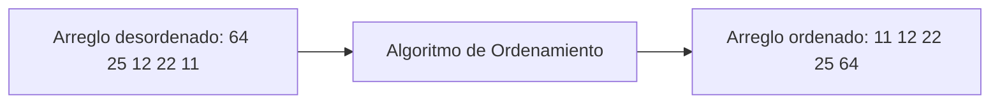
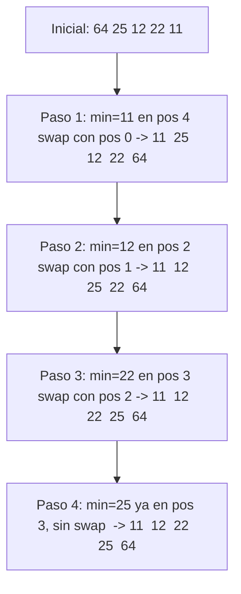
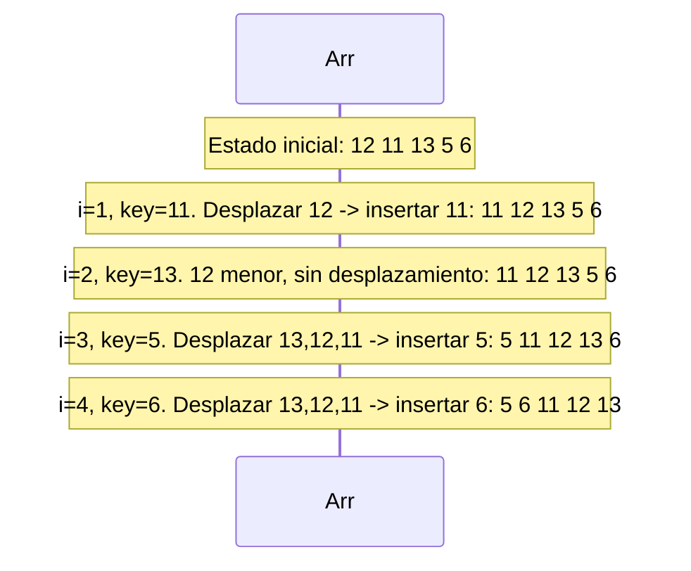
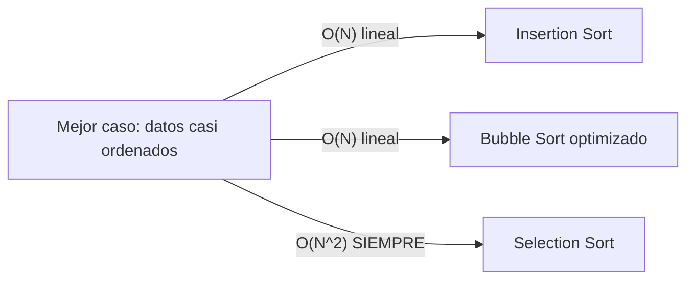

# L36 — Algoritmos de Ordenamiento Cuadráticos: Selección, Inserción y Burbuja

> [!NOTE]
> **Fundamentación Académica:** Esta lección sintetiza los conceptos del **Capítulo 10 (*Algorithmic Analysis*, pp. 429–478)** del libro oficial de Stanford CS106B (*Programming Abstractions in C++* por Eric Roberts), cubriendo **10.1** *The sorting problem* (p. 430) y **10.2** *Computational complexity* (p. 435).
>
> *"The selection sort algorithm is clearly not up to the task, because the running time increases in proportion to the square of the input size."*
> — CS106B, Sec. 10.3

---

## 🧭 Navegación Rápida

- 📄 **Lecturas Académicas Base:**
  - 🌲 [Stanford CS106B Textbook — Ch 10.1 (p. 430) & Ch 10.2 (p. 435)](../../files/cs106b/textbook/CS106BX-Reader.pdf)
- 💻 **Laboratorio de Código:** [`L36_QuadraticSorts.cpp`](../code/L36_QuadraticSorts.cpp)

---

## Objetivos de Aprendizaje

- [ ] Comprender la familia de algoritmos de **ordenamiento de complejidad cuadrática ($O(N^2)$)** (Sección 10.1).
- [ ] Dominar **Selection Sort** y su propiedad de mínimos intercambios.
- [ ] Dominar **Insertion Sort** y su rendimiento óptimo $O(N)$ en datos casi ordenados.
- [ ] Comprender **Bubble Sort** y su optimización de parada temprana.
- [ ] Diferenciar entre **Estabilidad de Ordenamiento** (*Stability*) y **Ordenamiento In-Place**.

---

## 1. El Problema del Ordenamiento (Sección 10.1)

El ordenamiento consiste en reorganizar $N$ elementos en un orden predeterminado. Es fundamental porque habilita algoritmos más rápidos como la **Búsqueda Binaria** ($O(\log N)$).



---

## 2. Selection Sort — Ordenamiento por Selección (Sección 10.1)

### Mecánica del Algoritmo

En cada iteración $i$, busca el **elemento mínimo** del subarreglo no ordenado $[i \dots N-1]$ y lo intercambia con la posición $i$.



### Implementación en C++

```cpp
#include <utility> // swap

void selectionSort(int arr[], int n) {
    for (int i = 0; i < n - 1; i++) {
        int minIdx = i; // Asumir que el mínimo está al inicio del subarreglo
        for (int j = i + 1; j < n; j++) {
            if (arr[j] < arr[minIdx]) minIdx = j; // Actualizar índice del mínimo
        }
        if (minIdx != i) swap(arr[i], arr[minIdx]); // Colocar mínimo en su lugar
    }
}
```

> [!NOTE]
> **Análisis de Complejidad de Selection Sort:**
> - **Comparaciones:** $\frac{N(N-1)}{2} = O(N^2)$ en **todos los casos** (mejor, promedio y peor).
> - **Intercambios:** Como máximo **$N-1$ intercambios** ($O(N)$) — ventaja cuando escribir en memoria es costoso.
> - **Estabilidad:** ❌ **Inestable** — los intercambios a larga distancia pueden alterar el orden relativo de duplicados.
> - **Espacio:** $O(1)$ — in-place.

---

## 3. Insertion Sort — Ordenamiento por Inserción (Sección 10.1)

> [!TIP]
> **La Analogía de las Cartas (Sec. 10.1):**
> Es como ordenar las cartas en tu mano. Tomas una carta nueva del mazo y la insertas en su posición correcta, desplazando hacia la derecha las cartas mayores.

### Mecánica del Algoritmo

Mantiene una **sub-lista izquierda ordenada**. Para cada nuevo elemento `key`, desplaza los elementos mayores a la derecha e inserta `key` en el espacio libre.



### Implementación en C++

```cpp
void insertionSort(int arr[], int n) {
    for (int i = 1; i < n; i++) {
        int key = arr[i]; // Elemento a insertar en la parte ordenada
        int j = i - 1;

        // Desplazar elementos mayores que key hacia la derecha
        while (j >= 0 && arr[j] > key) {
            arr[j + 1] = arr[j];
            j--;
        }
        arr[j + 1] = key; // Insertar key en su posición correcta
    }
}
```

> [!IMPORTANT]
> **El Comportamiento Adaptativo de Insertion Sort:**
> - **Peor Caso (arreglo invertido):** $O(N^2)$ — máximos desplazamientos.
> - **Mejor Caso (arreglo ya ordenado):** $\mathbf{O(N)}$ lineal — solo 1 comparación por elemento, 0 desplazamientos.
> - **Estabilidad:** ✅ **Estable** — preserva el orden relativo de claves iguales.
> - **Uso ideal:** Arreglos pequeños ($N < 20$) o datos casi ordenados.

---

## 4. Bubble Sort — Ordenamiento por Burbuja

Recorre el arreglo comparando pares adyacentes e intercambiándolos si están desordenados. Los elementos grandes "flotan" hacia el final como burbujas.

### Implementación Optimizada con Parada Temprana

```cpp
void bubbleSort(int arr[], int n) {
    for (int i = 0; i < n - 1; i++) {
        bool swapped = false;
        for (int j = 0; j < n - 1 - i; j++) {
            if (arr[j] > arr[j + 1]) {
                swap(arr[j], arr[j + 1]);
                swapped = true;
            }
        }
        if (!swapped) break; // Optimización: si no hubo swaps, ya está ordenado
    }
}
```

> [!TIP]
> La bandera `swapped` permite detectar cuando el arreglo ya está ordenado antes de completar todas las pasadas, logrando $O(N)$ en el mejor caso — igual que Insertion Sort.

---

## 5. Matriz Comparativa de Algoritmos Cuadráticos

| Algoritmo | Mejor Caso | Caso Promedio | Peor Caso | Espacio | Estabilidad | Swaps |
| :--- | :---: | :---: | :---: | :---: | :---: | :---: |
| **Selection Sort** | $O(N^2)$ | $O(N^2)$ | $O(N^2)$ | $O(1)$ | ❌ Inestable | $O(N)$ mínimo |
| **Insertion Sort** | $\mathbf{O(N)}$ | $O(N^2)$ | $O(N^2)$ | $O(1)$ | ✅ Estable | $O(N^2)$ |
| **Bubble Sort** | $\mathbf{O(N)}$ | $O(N^2)$ | $O(N^2)$ | $O(1)$ | ✅ Estable | $O(N^2)$ |



---

## ❓ Pregunta de Chequeo #1 — Selección del Algoritmo

Tienes $10{,}000$ registros que ya están **prácticamente ordenados** (solo 5 elementos fuera de lugar). ¿Qué algoritmo cuadrático deberías elegir y por qué?

<details>
<summary>🔍 <strong>Ver Explicación y Selección</strong></summary>

**Respuesta:** **Insertion Sort**.

**Justificación:** Insertion Sort es adaptativo y opera en tiempo casi lineal $O(N)$ cuando los datos están casi ordenados. Con solo 5 elementos fuera de lugar realizará aproximadamente $N + 5$ operaciones.

En contraste, Selection Sort **siempre** realiza $\frac{N(N-1)}{2} \approx 50{,}000{,}000$ comparaciones sin importar si el arreglo ya está ordenado.

</details>

---

## ❓ Pregunta de Chequeo #2 — Estabilidad

Tienes el arreglo de pares `[(3,A), (1,B), (3,C), (2,D)]` ordenado por el primer número. ¿Qué algoritmo garantiza que `(3,A)` quede **antes** que `(3,C)` en el resultado?

<details>
<summary>🔍 <strong>Ver Respuesta</strong></summary>

**Insertion Sort** o **Bubble Sort** — ambos son **estables** y preservan el orden relativo de claves iguales. Resultado: `[(1,B), (2,D), (3,A), (3,C)]`.

**Selection Sort** es **inestable** — puede producir `[(1,B), (2,D), (3,C), (3,A)]` dependiendo de los intercambios.

</details>

---

## 📝 Resumen de L35

1. **Selection Sort:** $O(N^2)$ comparaciones siempre, pero solo $O(N)$ intercambios — ideal cuando el costo de escritura es alto. Inestable.
2. **Insertion Sort:** $O(N)$ en el mejor caso (datos casi ordenados). Estable. Preferido para arreglos pequeños.
3. **Bubble Sort:** Fácil de implementar, optimizable con parada temprana, pero ineficiente para datos grandes.
4. **Estabilidad:** Un algoritmo es estable si preserva el orden relativo de elementos con claves duplicadas.
5. **In-Place:** Los tres algoritmos operan en $O(1)$ espacio auxiliar — sin necesidad de copias del arreglo.

---

<div align="center">

### 🧭 Navegación y Progresión

| ⬅️ Lección Anterior | 🏠 Inicio de Sección | ➡️ Siguiente Lección |
|:------------------:|:-------------------:|:------------------:|
| [**⬅️ L35 — Búsqueda Lineal y Binaria**](L35_LinearBinarySearch.md) | [**🏠 Recursión y Algoritmos**](../README.md) | [**L37 — MergeSort ➡️**](L37_MergeSort.md) |

</div>

---
*MiniLux0 — Learning C++ Section 05*
---

<div align="center">
  <sub>Maintained by <strong>MiniLux0</strong> · 2026</sub>
</div>