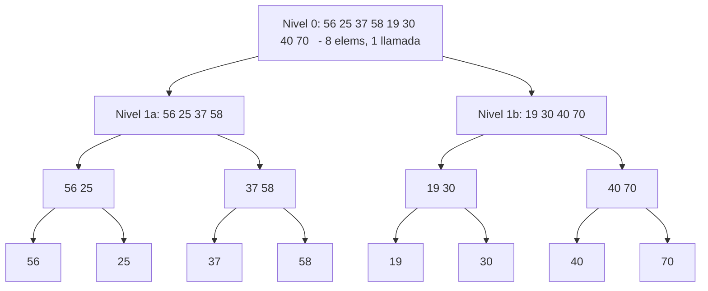

# L37 — MergeSort: Ordenamiento por Mezcla `O(N \log N)`

> [!NOTE]
> **Fundamentación Académica:** Esta lección sintetiza los conceptos del **Capítulo 10 (*Algorithmic Analysis*, pp. 429–478)** del libro oficial de Stanford CS106B (*Programming Abstractions in C++* por Eric Roberts), cubriendo **10.3** *Recursion to the rescue* (p. 443) y **10.4** *Standard complexity classes* (p. 449).

---

## 🧭 Navegación Rápida

- 📄 **Lecturas Académicas Base:**
  - 🌲 [Stanford CS106B Textbook — Ch 10.3 (p. 443) & Ch 10.4 (p. 449)](https://web.stanford.edu/class/cs106x/res/reader/CS106BX-Reader.pdf)
- 💻 **Laboratorio de Código:** [`L37_MergeSort.cpp`](../code/L37_MergeSort.cpp)

---

## Objetivos de Aprendizaje

- [ ] Entender por qué los algoritmos cuadráticos $O(N^2)$ son insuficientes para entradas grandes (Sección 10.3).
- [ ] Dominar la estrategia **Divide y Vencerás** aplicada al ordenamiento.
- [ ] Implementar el algoritmo **MergeSort** con sus dos funciones clave: `sort` y `merge`.
- [ ] Derivar matemáticamente la complejidad $O(N \log N)$ a partir del árbol de recursión.
- [ ] Interpretar la tabla comparativa $N^2$ vs $N \log N$ de la Figura 10-5 del texto (p. 447–448).

---

## 1. La Necesidad de un Mejor Algoritmo (Sección 10.3)

Los algoritmos cuadráticos como Selection Sort e Insertion Sort requieren $\frac{N(N-1)}{2}$ comparaciones. Para $N = 100,000$ eso son **5,000,000,000 operaciones** — inaceptable en la práctica.

> *"To develop a better sorting algorithm, you need to adopt a qualitatively different approach."*
> — CS106B, Sec. 10.3

### La Idea Clave: Explotar la Relación Inversa

> [!TIP]
> **La Propiedad Clave de los Algoritmos Cuadráticos (Sec. 10.3):**  
> Si el tamaño del problema se **duplica**, el tiempo cuadrático se **cuadruplica** ( $\times 4$ ).  
> Inversamente, si divides el problema a la **mitad**, el tiempo se **cuarteriza** ( $\div 4$ ).  
>
> Esto sugiere que dividir el arreglo en mitades y resolver recursivamente puede reducir el tiempo total de forma drástica.

---

## 2. Estrategia Divide y Vencerás: MergeSort

El algoritmo **MergeSort** (*Ordenamiento por Mezcla*) descrito en la Sección 10.3 usando la siguiente estrategia de 5 pasos:


---

## 3. El Paso de Mezcla (`merge`) — El Corazón del Algoritmo

La operación de **mezcla** reconstruye un vector ordenado combinando dos sub-vectores *ya ordenados*. Su lógica se basa en una observación clave: el primer elemento del vector final **siempre** es el menor de los primeros elementos de `v1` y `v2`.

### Visualización del Paso Merge

Partiendo de estas dos mitades ya ordenadas:

```
v1: [25, 30, 40, 70]
v2: [19, 35, 55, 80]
```

El proceso de mezcla compara cabezas y elige siempre el menor:

| Paso | v1 (p1) | v2 (p2) | Elegido | Resultado acumulado |
| :---: | :---: | :---: | :---: | :--- |
| 1 | **25** | **19** | 19 (de v2) | `[19]` |
| 2 | **25** | **35** | 25 (de v1) | `[19, 25]` |
| 3 | **30** | **35** | 30 (de v1) | `[19, 25, 30]` |
| 4 | **40** | **35** | 35 (de v2) | `[19, 25, 30, 35]` |
| 5 | **40** | **55** | 40 (de v1) | `[19, 25, 30, 35, 40]` |
| 6 | **70** | **55** | 55 (de v2) | `[19, 25, 30, 35, 40, 55]` |
| 7 | **70** | **80** | 70 (de v1) | `[19, 25, 30, 35, 40, 55, 70]` |
| 8 | *(vacío)* | **80** | 80 (de v2) | `[19, 25, 30, 35, 40, 55, 70, 80]` ✅ |

---

## 4. Implementación en C++

```cpp
#include <vector>
using namespace std;

// ── MEZCLA de dos vectores ya ordenados ──────────────────────────────────
void merge(vector<int>& dest, const vector<int>& v1, const vector<int>& v2) {
    int p1 = 0, p2 = 0;
    dest.clear();

    while (p1 < (int)v1.size() && p2 < (int)v2.size()) {
        if (v1[p1] <= v2[p2]) dest.push_back(v1[p1++]);
        else                   dest.push_back(v2[p2++]);
    }
    // Copiar el resto del vector no agotado
    while (p1 < (int)v1.size()) dest.push_back(v1[p1++]);
    while (p2 < (int)v2.size()) dest.push_back(v2[p2++]);
}

// ── MERGESORT recursivo ───────────────────────────────────────────────────
void mergeSort(vector<int>& vec) {
    if (vec.size() <= 1) return; // Caso Base

    int mid = vec.size() / 2;
    vector<int> v1(vec.begin(), vec.begin() + mid);
    vector<int> v2(vec.begin() + mid, vec.end());

    mergeSort(v1);              // Conquista izquierda
    mergeSort(v2);              // Conquista derecha
    merge(vec, v1, v2);         // Combinar
}
```

---

## 5. Árbol de Recursión y Derivación de `O(N \log N)`

### Árbol para `N = 8`



### ¿Cuántos Niveles Hay?

Cada nivel divide $N$ por 2. El número de niveles $k$ es aquel tal que $2^k = N$:

```math
k = \log_2 N
```

### Trabajo en Cada Nivel

En cada nivel se realiza una mezcla completa. La mezcla de todos los sub-vectores de un nivel cuesta exactamente **$N$ operaciones** en total (cada elemento se mueve exactamente una vez por nivel).

### Total de Trabajo

```math
\text{Niveles} \times \text{Trabajo por nivel} = \log_2 N \times N = O(N \log N)
```

---

## 6. Comparativa `N^2` vs `N \log N` (Figura 10-5, p. 447)

| $N$ | Selection Sort $O(N^2)$ | MergeSort $O(N \log N)$ | Factor de Mejora |
| :---: | :---: | :---: | :---: |
| 10 | 100 | ~33 | $\times 3$ |
| 100 | 10,000 | ~664 | $\times 15$ |
| 1,000 | 1,000,000 | ~9,965 | $\times 100$ |
| 10,000 | 100,000,000 | ~132,877 | $\times 753$ |
| 100,000 | **10,000,000,000** | ~1,660,964 | **$\times 6,021$** |

> *"For large vectors, merge sort clearly represents a significant improvement."*
> — CS106B, Sec. 10.3

---

## 7. Clases de Complejidad Estándar (Sección 10.4)

MergeSort introdujo la importancia de la clase $O(N \log N)$. El texto de Sección 10.4 presenta la jerarquía completa:

| Clase | Nombre | Ejemplo |
| :---: | :--- | :--- |
| $O(1)$ | Constante | Acceso a un índice de arreglo |
| $O(\log N)$ | Logarítmica | Búsqueda Binaria |
| $O(N)$ | Lineal | Búsqueda Lineal |
| $O(N \log N)$ | **Lineal-logarítmica** | **MergeSort** |
| $O(N^2)$ | Cuadrática | Selection Sort |
| $O(2^N)$ | Exponencial | Backtracking sin poda |


> [!IMPORTANT]
> **Tractable vs Intractable (Sec. 10.4):**  
> Los problemas solubles en tiempo **polinomial** ( $O(N^k)$ ) se consideran **tractables** (computacionalmente viables).  
> Los que solo tienen soluciones **exponenciales** ( $O(2^N)$ ) son **intratables** — por ejemplo, el Subset-Sum Problem (Cap. 8) y el Travelling Salesman Problem.

---

## ❓ Pregunta de Chequeo #1 — Árbol de Recursión

Para un vector de $N = 16$ elementos, ¿cuántos **niveles** tendrá el árbol de recursión de MergeSort y cuántas llamadas habrá en el último nivel antes de los casos base?

<details>
<summary>🔍 <strong>Ver Solución</strong></summary>

**Niveles:** $\log_2(16) = 4$ niveles de recursión (sin contar el nivel base).

**Llamadas en el último nivel antes de los casos base:** $2^4 = 16$ llamadas, cada una con un sub-vector de **2 elementos** que se mezclan en vectores de **1 elemento**.

</details>

---

## ❓ Pregunta de Chequeo #2 — Estabilidad

¿Es MergeSort un algoritmo **estable**?

<details>
<summary>🔍 <strong>Ver Respuesta</strong></summary>

**Sí, MergeSort es estable.** En el paso de mezcla, cuando `v1[p1] <= v2[p2]`, elegimos el de `v1` (izquierda) primero. Esto preserva el orden relativo de elementos con claves iguales que estaban originalmente en la mitad izquierda antes que los de la derecha.

</details>

---

## 📝 Resumen de L36

1. **MergeSort** aplica la estrategia **Divide y Vencerás** recursivamente para alcanzar $O(N \log N)$.
2. El paso `merge` combina dos sub-vectores **ya ordenados** en $O(N)$ comparaciones.
3. El **árbol de recursión** tiene $\log_2 N$ niveles, con $N$ trabajo total por nivel → $O(N \log N)$.
4. Para $N = 100,000$: Selection Sort tardó **>2.5 minutos**; MergeSort **<0.5 segundos** (Sec. 10.3).
5. MergeSort es **estable** y **no in-place** — requiere $O(N)$ memoria auxiliar para los sub-vectores.

---

<div align="center">

### 🧭 Navegación y Progresión

| ⬅️ Lección Anterior | 🏠 Inicio de Sección | ➡️ Siguiente Lección |
|:------------------:|:-------------------:|:------------------:|
| [**⬅️ L35 — Ordenamientos Cuadráticos**](L36_QuadraticSorts.md) | [**🏠 Recursión y Algoritmos**](../README.md) | [**L38 — QuickSort ➡️**](L38_QuickSort.md) |

</div>

---

<div align="center">
  <sub>Maintained by <strong>MiniLux0</strong> · 2026</sub>
</div>