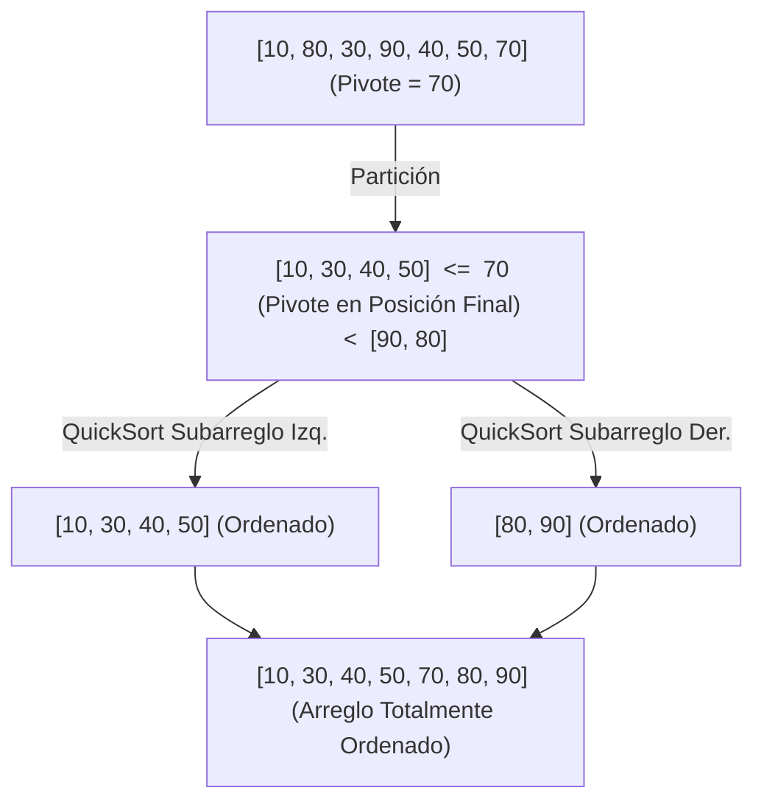

# L37 — QuickSort: Ordenamiento Rápido, Estrategias de Pivote y Particionado In-Place

> [!NOTE]
> **Fundamentación Académica:** Esta lección sintetiza los conceptos del **Capítulo 10.3 (*QuickSort*)** del libro oficial de Stanford CS106B ([`CS106BX-Reader.pdf`](../../files/cs106b/textbook/CS106BX-Reader.pdf)) y **Stanford CS106X Handouts**.

---

## 🧭 Navegación Rápida

- 📄 **Lecturas Académicas Base:**
  - 🌲 [Stanford CS106B Textbook (Ch 10.3, pp. 465–470)](../../files/cs106b/textbook/CS106BX-Reader.pdf)
  - ⚡ [Stanford CS106X — Hoare Partition & Pivot Strategies](../../files/cs106x/README.md)
- 💻 **Laboratorio de Código:** [`L37_QuickSort.cpp`](../code/L37_QuickSort.cpp)

---

## Objetivos de Aprendizaje

- [ ] Comprender la mecánica de **particionado in-place** de QuickSort.
- [ ] Dominar la elección de **pivote** (Primer elemento, Último elemento, Aleatorio, Mediana de 3).
- [ ] Analizar por qué el promedio es **$O(N \log N)$** pero el peor caso puede degenerar en **$O(N^2)$**.
- [ ] Comparar las ventajas de **QuickSort (In-Place)** frente a **MergeSort (Memoria $O(N)$)**.

---

## 1. El Concepto de Particionado

QuickSort selecciona un elemento especial llamado **pivote** y reorganiza los elementos del arreglo en torno a él:
- Todos los elementos **menores o iguales** que el pivote van a su **izquierda**.
- Todos los elementos **mayores** que el pivote van a su **derecha**.
- Al terminar el particionado, el pivote queda ubicado en su **posición ordenada definitiva final**.



---

## 2. Esquema de Particionado (Lomuto Partition)

### Implementación C++:

```cpp
#include <utility> // std::swap

// Función de particionado Lomuto
int partition(int arr[], int low, int high) {
    int pivot = arr[high]; // Selecciona el último elemento como pivote
    int i = low - 1;       // Índice de elementos menores que el pivote

    for (int j = low; j < high; j++) {
        if (arr[j] <= pivot) {
            i++;
            std::swap(arr[i], arr[j]);
        }
    }
    std::swap(arr[i + 1], arr[high]);
    return i + 1; // Retorna el índice definitivo del pivote
}

void quickSort(int arr[], int low, int high) {
    if (low < high) {
        // pi es el índice de partición
        int pi = partition(arr, low, high);

        // Ordenar recursivamente los elementos antes y después de la partición
        quickSort(arr, low, pi - 1);
        quickSort(arr, pi + 1, high);
    }
}
```

---

## 3. La Importancia de la Elección del Pivote

> [!WARNING]
> **El Peor Caso $O(N^2)$:** Si el arreglo ya está **totalmente ordenado** o invertido y elegimos siempre el primer o último elemento como pivote, el particionado creará subarreglos desbalanceados de tamaño $0$ y $N-1$, resultando en una complejidad degenerada de **$O(N^2)$**.

### Estrategias de Prevención del Peor Caso:
1. **Pivote Aleatorio (*Randomized QuickSort*):** Selecciona una posición al azar entre `low` y `high` antes de particionar.
2. **Mediana de Tres (*Median-of-Three*):** Toma la mediana entre el primer elemento, el elemento central y el último elemento (`arr[low]`, `arr[mid]`, `arr[high]`).

---

## 4. Comparativa: QuickSort vs. MergeSort

| Criterio | QuickSort | MergeSort |
| :--- | :--- | :--- |
| **Promedio de Tiempo** | **$O(N \log N)$** (Con factor constante más pequeño) | $O(N \log N)$ |
| **Peor Caso** | $O(N^2)$ (Evitable con pivote aleatorio) | **$O(N \log N)$ garantizado** |
| **Memoria Extra** | **$O(\log N)$** (Pila de llamadas) — **In-Place** | $O(N)$ (Arreglos auxiliares) |
| **Estabilidad** | Inestable | **Estable** |
| **Uso Preferido** | C++ Standard Library (`std::sort`), arreglos en memoria RAM. | Linked Lists y ordenamiento externo de gran tamaño. |

---

## ❓ Pregunta de Chequeo #1 — ¿Por qué `std::sort` de C++ prefiere QuickSort?

**¿Por qué las bibliotecas estándar de C++ (`std::sort`) utilizan variaciones de QuickSort (Introsort) en lugar de MergeSort para arreglos en memoria?**

<details>
<summary>🔍 <strong>Ver Explicación</strong></summary>

> [!TIP]
> **Respuesta:**
> 1. **Uso Eficiente de Caché:** QuickSort trabaja **In-Place** sobre el mismo bloque contiguo de memoria RAM, aprovechando al máximo la caché L1/L2 de la CPU.
> 2. **Sin asignaciones dinámicas:** MergeSort requiere constantemente reservar y liberar memoria auxiliar $O(N)$, lo que agrega una sobrecarga de rendimiento considerable.

</details>

---

## 📝 Resumen Resumido de L37

1. QuickSort reorganiza el arreglo in-place en torno a un **pivote**.
2. Complejidad promedio de **$O(N \log N)$** en tiempo y **$O(\log N)$** en espacio de pila.
3. Usar **pivotes aleatorios** previene el peor caso de $O(N^2)$.

---

<div align="center">

### 🧭 Navigation & Progression

| ⬅️ Previous Lesson | 🏠 Section Home | ➡️ Next Lesson |
|:------------------:|:--------------:|:--------------:|
| [**⬅️ L36 — MergeSort**](L36_MergeSort.md) | [**🏠 Recursion & Algorithms**](../README.md) | [**L38 — Backtracking ➡️**](L38_Backtracking.md) |

</div>

---
*MiniLux0 — Learning C++ Section 05*
