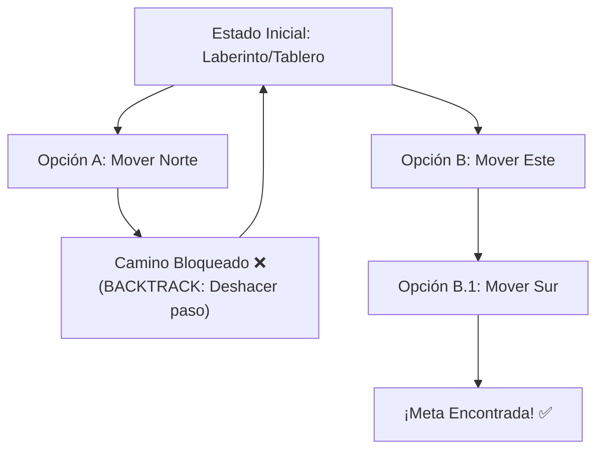

# L38 — Backtracking Recursivo: Búsqueda en Espacios de Estados y Árboles de Decisión

> [!NOTE]
> **Fundamentación Académica:** Esta lección sintetiza los conceptos del **Capítulo 8 (*Recursive Strategies*, pp. 349–388)** y **Capítulo 9 (*Backtracking Algorithms*, pp. 389–428)** del libro oficial de Stanford CS106B (*Programming Abstractions in C++* por Eric Roberts) y **Stanford CS106X Handouts**, cubriendo **8.2** *Subset-sum* (p. 361), **8.3** *Permutations* (p. 364), **8.4** *Graphical recursion* (p. 368), **9.1** *Maze backtracking* (p. 390), **9.2** *Games* (p. 400) y **9.3** *The minimax algorithm* (p. 409).

---

## 🧭 Navegación Rápida

- 📄 **Lecturas Académicas Base:**
  - 🌲 [Stanford CS106B Textbook — Ch 8 (pp. 349–388) & Ch 9 (pp. 389–428)](../../files/cs106b/textbook/CS106BX-Reader.pdf)
  - ⚡ [Stanford CS106X — State Space Search & Backtracking](../../files/cs106x/README.md)
- 💻 **Laboratorio de Código:** [`L38_Backtracking.cpp`](../code/L38_Backtracking.cpp)

---

## Objetivos de Aprendizaje

- [ ] Comprender qué es el **Backtracking Recursivo** y cómo explora un **Árbol de Decisión (*Decision Tree*)**.
- [ ] Dominar el patrón de diseño clásico de 3 pasos: **Elegir, Explorar, Deshacer (*Choose, Explore, Unchoose*)**.
- [ ] Aplicar la **poda (*Pruning*)** para descartar ramas inválidas del árbol antes de explorarlas por completo.
- [ ] Resolver problemas clásicos: Subconjuntos, Permutaciones y las N-Reinas.

---

## 1. El Paradigma del Backtracking

El Backtracking es una técnica de búsqueda exhaustiva sistemática. Intenta construir una solución paso a paso. Si en cualquier punto descubre que las decisiones actuales **no pueden conducir a una solución válida**, el algoritmo realiza un **retrocero (*backtrack*)**: revierte la última decisión tomada y prueba una opción alternativa.



---

## 2. El Patrón Universal de 3 Pasos: *Choose, Explore, Unchoose*

Toda función de backtracking recursivo sigue esta estructura fundamental:

```cpp
void resolverBacktracking(Estado& estado) {
    // 1. Caso Base: ¿Alcanzamos una solución válida o completa?
    if (esSolucionCompleta(estado)) {
        procesarSolucion(estado);
        return;
    }

    // 2. Iterar sobre todas las elecciones posibles en el nivel actual
    for (const auto& opcion : listaDeOpciones) {
        if (esValida(opcion, estado)) { // PODA (Pruning)
            
            // PASO 1: ELEGIR (Make a choice)
            hacerEleccion(opcion, estado);

            // PASO 2: EXPLORAR (Recursive step)
            resolverBacktracking(estado);

            // PASO 3: DESHACER (Unchoose / Backtrack)
            deshacerEleccion(opcion, estado);
        }
    }
}
```

---

## 3. Ejemplo Clásico 1: Generación de Subconjuntos (*Subsets*)

Dado un conjunto como `{"A", "B", "C"}`, generar todos los $2^N$ subconjuntos posibles:

```cpp
#include <iostream>
#include <vector>
#include <string>
using namespace std;

void generarSubconjuntos(const vector<char>& v, int index, vector<char>& actual) {
    // Caso Base: Hemos tomado una decisión para cada elemento
    if (index == (int)v.size()) {
        cout << "{ ";
        for (char c : actual) cout << c << " ";
        cout << "}\n";
        return;
    }

    // Decisión 1: NO incluir v[index]
    generarSubconjuntos(v, index + 1, actual);

    // Decisión 2: INCLUIR v[index]
    actual.push_back(v[index]);               // ELEGIR
    generarSubconjuntos(v, index + 1, actual); // EXPLORAR
    actual.pop_back();                        // DESHACER (Backtrack)
}
```

---

## 4. Ejemplo Clásico 2: El Problema de las N-Reinas (*N-Queens*)

Ubicar $N$ reinas de ajedrez en un tablero de $N \times N$ de tal forma que ninguna reina ataque a otra (mismo renglón, columna o diagonal).

> [!TIP]
> **Poda (*Pruning*):** La función de validación `esSeguro(tablero, fila, col)` comprueba que la nueva reina no esté amenazada por reinas previamente colocadas. Si la posición es insegura, la rama entera se descarta de inmediato sin continuar explorándola.

---

## ❓ Pregunta de Chequeo #1 — ¿Por qué es obligatorio el paso "Unchoose"?

**En la plantilla de Backtracking, ¿qué ocurriría si olvidamos ejecutar el paso de deshacer la elección (`unchoose` / `actual.pop_back()`) al regresar de la llamada recursiva?**

<details>
<summary>🔍 <strong>Ver Explicación</strong></summary>

> [!CAUTION]
> **Diagnóstico:** Las decisiones tomadas en una rama del árbol de búsqueda se "contaminarán" y filtrarán a las ramas vecinas independientes, arruinando el estado del tablero/conjunto para las opciones siguientes y produciendo soluciones incorrectas o corruptas.

</details>

---

## 📝 Resumen Resumido de L38

1. Backtracking explora exhaustivamente árboles de decisión.
2. El patrón universal es **Choose $\to$ Explore $\to$ Unchoose**.
3. La **Poda (*Pruning*)** evita explorar ramas inválidas, reduciendo dramáticamente el tiempo de búsqueda.

---

<div align="center">

### 🧭 Navigation & Progression

| ⬅️ Previous Lesson | 🏠 Section Home | ➡️ Next Lesson |
|:------------------:|:--------------:|:--------------:|
| [**⬅️ L37 — QuickSort**](L37_QuickSort.md) | [**🏠 Recursion & Algorithms**](../README.md) | [**Section 06: Pointers ➡️**](../../06_Pointers/) |

</div>

---
*MiniLux0 — Learning C++ Section 05*
