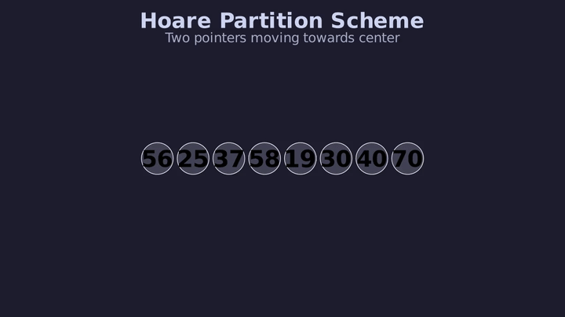
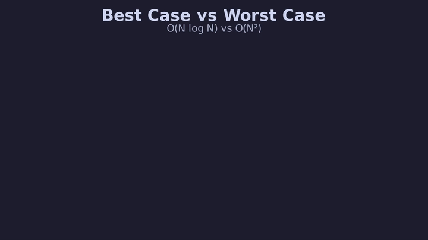

# L38 — QuickSort: Ordenamiento Rápido `O(N \log N)` In-Place

> [!NOTE]
> **Fundamentación Académica:** Esta lección sintetiza los conceptos del **Capítulo 10 (*Algorithmic Analysis*, pp. 429–478)** del libro oficial de Stanford CS106B (*Programming Abstractions in C++* por Eric Roberts), cubriendo **10.5** *The Quicksort algorithm* (p. 452).

---

## 🧭 Navegación Rápida

- 📄 **Lecturas Académicas Base:**
  - 🌲 [Stanford CS106B Textbook — Ch 10.5 (p. 452)](https://web.stanford.edu/class/cs106x/res/reader/CS106BX-Reader.pdf)
- 💻 **Laboratorio de Código:** [`L38_QuickSort.cpp`](../code/L38_QuickSort.cpp)

---

## Objetivos de Aprendizaje

- [ ] Comprender la motivación de QuickSort como alternativa **in-place** a MergeSort (Sección 10.5).
- [ ] Dominar el concepto de **pivote** y la operación de **partición** (Sección 10.5).
- [ ] Implementar el **esquema de partición de Hoare** (Sección 10.5).
- [ ] Analizar el **caso promedio $O(N \log N)$** y el **peor caso $O(N^2)$** de QuickSort.
- [ ] Entender la estrategia de **pivote aleatorio** como mitigación del peor caso.

---

## 1. Motivación: QuickSort vs MergeSort (Sección 10.5)

> *"Even though the merge sort algorithm performs well in theory and has a worst-case complexity of O(N log N), it is not used much in practice. Instead, most sorting programs in use today are based on an algorithm called Quicksort."*
> — CS106B, Sec. 10.5 (p. 452)

Tanto MergeSort como QuickSort emplean **Divide y Vencerás**, pero con una diferencia fundamental:

| Aspecto | MergeSort | QuickSort |
| :--- | :--- | :--- |
| **Cómo divide** | Siempre en dos mitades **iguales** | Con base en el valor del **pivote** |
| **Cuándo ordena** | Al **combinar** (merge) | **Durante la partición** |
| **Memoria auxiliar** | $O(N)$ para sub-vectores | $O(\log N)$ solo para la pila recursiva |
| **Peor caso** | $O(N \log N)$ siempre | $O(N^2)$ (arreglo ya ordenado) |
| **Velocidad práctica** | Más lento en la práctica | **Varias veces más rápido** (Figura 10-10) |

---

## 2. La Estrategia de QuickSort (Sección 10.5)

El algoritmo de 3 pasos de la Sección 10.5:

<div align="center">
  
</div>

---

## 3. El Paso de Partición — Algoritmo de Hoare (Sección 10.5)

La parte más importante y sutil de QuickSort. Tony Hoare's original partitioning algorithm:

> *"The tricky part about partition is to rearrange the elements without using any extra storage, which is typically done by swapping pairs of elements."*
> — CS106B, Sec. 10.5 (p. 454)

### Mecánica del Esquema de Hoare

Asumimos que el pivote es `arr[low]` (primer elemento). Se usan dos punteros `lh` (left-hand) y `rh` (right-hand):

<div align="center">
  
</div>

### Implementación C++ del Esquema de Hoare

```cpp
#include <utility> // swap
using namespace std;

int particionHoare(int arr[], int low, int high) {
    int pivot = arr[low]; // Pivote = primer elemento
    int lh = low + 1;
    int rh = high;

    while (true) {
        while (lh <= rh && arr[lh] < pivot) lh++;
        while (rh >= lh && arr[rh] >= pivot) rh--;
        if (lh > rh) break;
        swap(arr[lh], arr[rh]);
        lh++; rh--;
    }
    swap(arr[low], arr[rh]); // Pivote a su posición definitiva
    return rh;               // Índice definitivo del pivote
}

void quickSort(int arr[], int low, int high) {
    if (low >= high) return; // Caso Base
    int pivotIdx = particionHoare(arr, low, high);
    quickSort(arr, low, pivotIdx - 1);
    quickSort(arr, pivotIdx + 1, high);
}
```

---

## 4. Análisis de Complejidad (Sección 10.5)

### Caso Promedio: `O(N \log N)`

Si el pivote es siempre la **mediana** del sub-arreglo, cada partición divide en dos mitades iguales → árbol de recursión de $\log_2 N$ niveles con $O(N)$ trabajo cada uno:

```math
T(N) = O(N \log N)
```

### Peor Caso: `O(N^2)` — El Arreglo Ya Ordenado

> [!WARNING]
> **La Paradoja del Peor Caso (Sec. 10.5, p. 458):**
> Si el pivote siempre es el **elemento más pequeño** del subarreglo (ej. primer elemento de un arreglo ya ordenado), una partición de $N$ elementos produce subarreglos de tamaños **0** y **N-1**, degenerando a:
>
> ```math
> T(N) = N + (N-1) + (N-2) + \dots + 1 = \frac{N(N-1)}{2} = O(N^2)
> ```
>
> En el código del laboratorio esto se puede ver en la Demo 2: para $N=8$ ya ordenado, se requieren **35 comparaciones** vs **17** en el caso aleatorio.

<div align="center">
  
</div>

---

## 5. Mitigación: Pivote Aleatorio (Sección 10.5)

La Sección 10.5 describe dos estrategias para evitar el peor caso:

> *"One simple approach is to have the Quicksort implementation choose the pivot element at random. Although it is still possible that the random process will choose a poor pivot value, it is unlikely that it would make the same mistake repeatedly at each level."*
> — CS106B, Sec. 10.5 (p. 458)

```cpp
// Antes de particionar: elegir un índice aleatorio y moverlo al inicio/final
int rIdx = low + rand() % (high - low + 1);
swap(arr[rIdx], arr[high]); // Lomuto: pivote al final
```

La otra estrategia mencionada es **Median-of-Three**: elegir la mediana entre el primer, el del medio y el último elemento como pivote.

---

## 6. Comparativa de Rendimiento QuickSort vs MergeSort

> *"This implementation of Quicksort tends to run several times faster than the implementation of merge sort."*
> — CS106B, Figura 10-10 (p. 457)

| $N$ | MergeSort $O(N \log N)$ | QuickSort (Caso Promedio) | QuickSort (Peor Caso $O(N^2)$) |
| :---: | :---: | :---: | :---: |
| 10 | ~33 ops | ~20 ops | ~45 ops |
| 1,000 | ~10,000 ops | ~7,000 ops | ~500,000 ops |
| 100,000 | ~1.7M ops | ~1.2M ops | ~5,000M ops ❌ |

**Conclusión:** En la **práctica** con datos aleatorios, QuickSort gana. Para **datos casi ordenados o con garantía de $O(N \log N)$**, MergeSort es más seguro.

---

## ❓ Pregunta de Chequeo #1 — Posición del Pivote

Después de ejecutar la partición de Hoare sobre `[56, 25, 37, 58, 19, 30, 40, 70]` con pivote `56`, ¿en qué índice quedará el pivote en su **posición definitiva**?

<details>
<summary>🔍 <strong>Ver Solución</strong></summary>

**Índice 4.** El pivote `56` quedará en la posición 4 (0-indexado), con `[19, 25, 37, 40]` a la izquierda y `[58, 70]` a la derecha. Las llamadas recursivas serán sobre `[0..3]` y `[5..7]`.

</details>

---

## ❓ Pregunta de Chequeo #2 — Elección de Algoritmo

¿En qué situación preferirías **MergeSort** sobre QuickSort aunque este sea más rápido en promedio?

<details>
<summary>🔍 <strong>Ver Respuesta</strong></summary>

**Situaciones donde MergeSort es preferible:**
1. Los datos de entrada pueden estar **casi o completamente ordenados** (peor caso de QuickSort).
2. Se requiere **estabilidad** (MergeSort es estable, QuickSort con Hoare no).
3. Se trabaja con **listas enlazadas** donde el acceso aleatorio es costoso y MergeSort opera secuencialmente.
4. Se necesita una garantía de $O(N \log N)$ en el **peor caso** (ej. sistemas en tiempo real).

</details>

---

## 📝 Resumen de L38

1. **QuickSort** elige un **pivote** y reorganiza el arreglo **in-place** para que todo lo menor quede a la izquierda y todo lo mayor a la derecha.
2. El **esquema de Hoare** (Sec. 10.5) usa dos punteros `lh` y `rh` que avanzan hacia el centro intercambiando elementos fuera de lugar.
3. **Caso promedio:** $O(N \log N)$ cuando el pivote es cercano a la mediana.
4. **Peor caso:** $O(N^2)$ cuando el arreglo ya está ordenado y se usa el primer elemento como pivote.
5. **Pivote Aleatorio** o **Median-of-Three** son estrategias para mitigar el peor caso.
6. QuickSort es **in-place** ($O(\log N)$ pila recursiva); MergeSort requiere $O(N)$ memoria auxiliar.

---

<div align="center">

### 🧭 Navegación y Progresión

| ⬅️ Lección Anterior | 🏠 Inicio de Sección | ➡️ Siguiente Lección |
|:------------------:|:-------------------:|:------------------:|
| [**⬅️ L37 — MergeSort**](L37_MergeSort.md) | [**🏠 Recursión y Algoritmos**](../README.md) | [**L39 — Backtracking ➡️**](L39_Backtracking.md) |

</div>

---

<div align="center">
  <sub>Maintained by <strong>MiniLux0</strong> · 2026</sub>
</div>