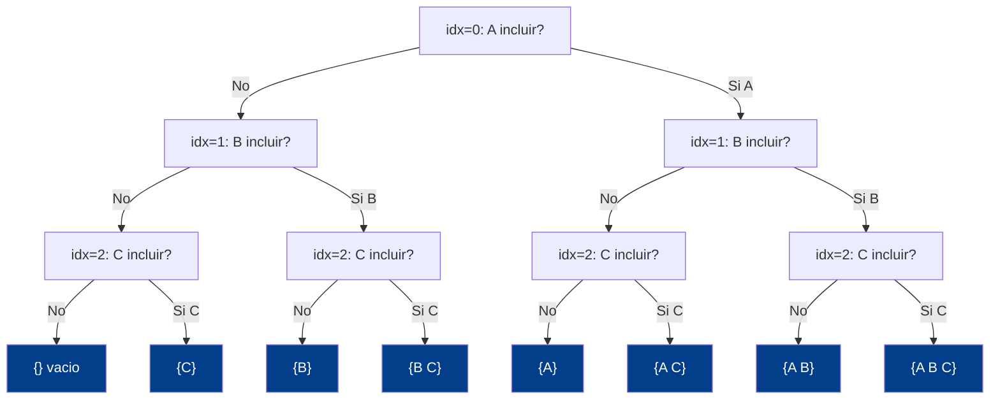
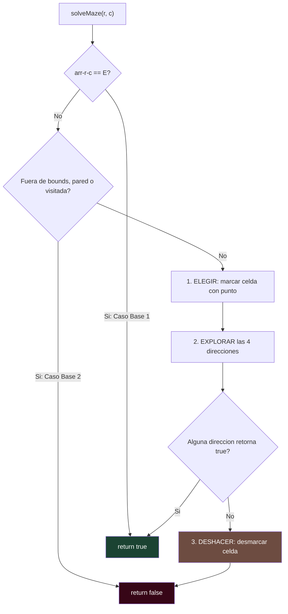
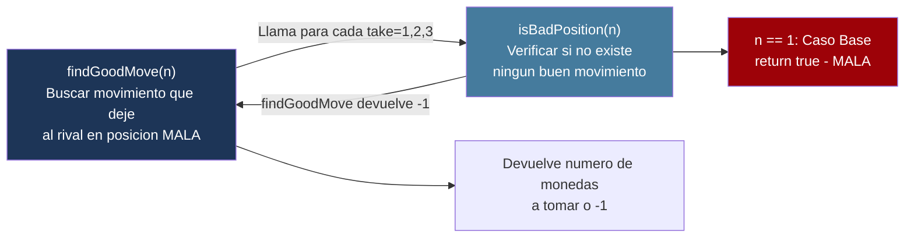

# L39 — Backtracking Recursivo: Choose, Explore, Unchoose

> [!NOTE]
> **Fundamentación Académica:** Esta lección sintetiza los conceptos del **Capítulo 8 (*Recursive Strategies*, pp. 349–388)** y **Capítulo 9 (*Backtracking Algorithms*, pp. 389–428)** del libro oficial de Stanford CS106B (*Programming Abstractions in C++* por Eric Roberts), cubriendo **9.1** *Recursive backtracking in a maze* (p. 390) y **9.2** *Backtracking and games* (p. 400) y la estrategia *Choose-Explore-Unchoose* del Capítulo 8.

---

## 🧭 Navegación Rápida

- 📄 **Lecturas Académicas Base:**
  - 🌲 [Stanford CS106B Textbook — Ch 8 (p. 349) & Ch 9 (p. 389)](https://web.stanford.edu/class/cs106x/res/reader/CS106BX-Reader.pdf)
- 💻 **Laboratorio de Código:** [`L39_Backtracking.cpp`](../code/L39_Backtracking.cpp)

---

## Objetivos de Aprendizaje

- [ ] Comprender qué es un **algoritmo de backtracking** y cuándo se aplica.
- [ ] Dominar el patrón universal: **Choose → Explore → Unchoose** (Cap. 8).
- [ ] Implementar la **resolución recursiva de laberintos** con marcado y desmarcado (Sección 9.1).
- [ ] Analizar el **Juego Nim** como ejemplo de backtracking sobre juegos con `findGoodMove` / `isBadPosition` mutuamente recursivos (Sección 9.2).
- [ ] Entender la diferencia entre **backtracking** (deshacer elecciones) y la recursión simple.

---

## 1. ¿Qué es el Backtracking? (Capítulo 9, p. 390)

> *"For many real-world problems, the solution process consists of working your way through a sequence of decision points in which each choice leads you further along some path. If you reach a dead end, you have to backtrack to a previous decision point and try a different path."*
> — CS106B, Cap. 9 (p. 390)

El backtracking es una estrategia para explorar un espacio de decisiones donde:
1. **Tomas una decisión** (ej. girar a la derecha en un laberinto).
2. **Exploras** el camino resultante recursivamente.
3. **Si llegas a un callejón sin salida**, deshaces la decisión (*backtrack*) y pruebas la siguiente opción.

> [!TIP]
> **Insight Fundamental (p. 390):**  
> Un problema de backtracking tiene solución **si y solo si** al menos uno de los subproblemas que resultan de cada posible elección inicial tiene solución. Esto lo hace naturalmente recursivo.

---

## 2. El Patrón Universal: Choose → Explore → Unchoose (Cap. 8)

Todos los algoritmos de backtracking siguen la misma plantilla de 3 pasos:

```
for cada opción posible:
    1. ELEGIR   (Choose)   → aplicar la opción, modificar el estado
    2. EXPLORAR (Explore)  → llamada recursiva con el nuevo estado
    3. DESHACER (Unchoose) → revertir la modificación (backtrack)
```

### Ejemplo: Generar el Power Set de `{A, B, C}`

Para cada elemento decidimos: ¿lo incluimos o no?

```cpp
void generarSubconjuntos(const vector<char>& elems, int idx, vector<char>& actual) {
    if (idx == (int)elems.size()) {
        // Caso Base: imprimir el subconjunto actual
        for (char c : actual) cout << c << " ";
        return;
    }

    // Opción A: NO incluir elems[idx]
    generarSubconjuntos(elems, idx + 1, actual);

    // Opción B: SÍ incluir elems[idx]
    actual.push_back(elems[idx]);           // 1. ELEGIR
    generarSubconjuntos(elems, idx + 1, actual); // 2. EXPLORAR
    actual.pop_back();                      // 3. DESHACER
}
```

**Árbol de decisión** para `{A, B, C}`:



Total: $`2^3 = 8`$ subconjuntos — el Power Set completo.

---

## 3. Backtracking en Laberintos (Sección 9.1 — El Laberinto de Teseo)

> *"Once upon a time... Minos demanded tribute from Athens in the form of young men and women whom he sacrificed to the Minotaur."*
> *"Theseus entered the labyrinth with a sword and a ball of string."*
> — CS106B, Sec. 9.1 (p. 390)

### Los Dos Casos Base (p. 393)

```
CASO BASE 1: La celda actual está FUERA del laberinto → solución encontrada (true)
CASO BASE 2: La celda actual es una PARED o ya fue VISITADA → callejón sin salida (false)
```

### Implementación Recursiva

```cpp
bool solveMaze(int r, int c) {
    // Caso Base 1: llegamos a la salida
    if (laberinto[r][c] == 'E') return true;

    // Caso Base 2: posición inválida o ya visitada
    if (fuera_de_bounds || es_pared || ya_visitada) return false;

    laberinto[r][c] = '.';   // 1. ELEGIR — marcar como visitado

    // 2. EXPLORAR las 4 direcciones
    if (solveMaze(r-1, c)) return true;  // Norte
    if (solveMaze(r+1, c)) return true;  // Sur
    if (solveMaze(r, c+1)) return true;  // Este
    if (solveMaze(r, c-1)) return true;  // Oeste

    laberinto[r][c] = ' ';  // 3. DESHACER — backtrack (desmarcar)
    return false;
}
```



### Traza del Laberinto (Demo 2)

```
Inicial:           Solución (camino con '.'):
#########          #########
#   #  E#          #...#..E#
#S# # ###    →     #.#.#.###
# #     #          # #...  #
#########          #########
```

> [!IMPORTANT]
> **La Clave del Desmarcado (p. 393):**  
> El paso `laberinto[r][c] = ' '` al final es esencial. Sin él, la función marcaría caminos explorados fallidos como "visitados" y bloquearía el retroceso. El backtracking **deshace** el marcado cuando un camino no lleva a la salida.

---

## 4. Backtracking en Juegos: El Juego Nim (Sección 9.2)

> *"A backtracking problem has a solution if and only if at least one of the smaller backtracking problems that result from making each possible initial choice has a solution."*
> — CS106B, Sec. 9.2 (p. 390)

### Reglas del Nim (Sec. 9.2, p. 401)

- Montón inicial de **13 monedas**.
- Cada turno, un jugador toma **1, 2 o 3** monedas.
- El jugador que toma la **última moneda PIERDE**.

### Estrategia Óptima: Mutua Recursión

Existe una estrategia elegante usando dos funciones **mutuamente recursivas**:



```cpp
// Una posición es BUENA si existe al menos un movimiento que deja al rival en posición MALA
int findGoodMove(int nCoins) {
    for (int take = 1; take <= 3 && take < nCoins; take++) {
        if (isBadPosition(nCoins - take)) return take; // Encontrado!
    }
    return -1; // No existe buen movimiento
}

// Una posición es MALA si no existe ningún buen movimiento
bool isBadPosition(int nCoins) {
    if (nCoins == 1) return true;        // Caso Base: 1 moneda = perder
    return findGoodMove(nCoins) == -1;   // Sin buen movimiento = mala
}
```

### Análisis de Posiciones (patrón cada 4)

| Monedas | Tipo | Razonamiento |
| :---: | :---: | :--- |
| **1** | ❌ Mala | Obligado a tomar la última → pierdes |
| 2, 3, 4 | ✅ Buena | Puedes dejar 1 al rival |
| **5** | ❌ Mala | Cualquier movimiento deja 2–4 al rival (buenas para él) |
| 6, 7, 8 | ✅ Buena | Puedes dejar 5 al rival |
| **9** | ❌ Mala | Análoga a 5 |
| **13** | ✅ Buena | La computadora toma 1 → rival con 12 (buena para la compu) |

**Patrón:** las posiciones malas son $`1, 5, 9, 13, \ldots`$ — números de la forma $`4k+1`$.

---

## 5. Comparativa: Backtracking vs Recursión Simple

| Característica | Recursión Simple | Backtracking |
| :--- | :--- | :--- |
| **Propósito** | Resolver un subproblema único | Explorar *múltiples* caminos posibles |
| **Estado** | No modifica estado compartido | Modifica y **revierte** estado |
| **Clave** | Reducción del problema | **Choose → Explore → Unchoose** |
| **Ejemplo** | Factorial, Fibonacci | Laberinto, N-Reinas, Sudoku |
| **Peor caso** | $`O(2^N)`$ sin poda | $`O(2^N)`$ pero con poda se reduce mucho |

---

## ❓ Pregunta de Chequeo #1 — Nim con 9 Monedas

Desde 9 monedas, el humano juega primero y toma 2. ¿La computadora puede garantizar ganar desde las 7 monedas restantes?

<details>
<summary>🔍 <strong>Ver Respuesta</strong></summary>

**Sí.** 7 monedas es una posición **buena** para quien mueve. La computadora debe tomar 2 monedas (dejando 5 al humano, posición **mala**). Desde 5, el humano queda atrapado en el mismo ciclo. Finalmente la computadora dejará 1 al humano → computadora gana.

</details>

---

## ❓ Pregunta de Chequeo #2 — Backtracking en el Laberinto

¿Qué pasaría si elimináramos el paso `laberinto[r][c] = ' '` (el DESHACER) de `solveMaze`?

<details>
<summary>🔍 <strong>Ver Respuesta</strong></summary>

Sin el paso de desmarcar, las celdas exploradas en caminos fallidos quedarían marcadas como `.`. Esto bloquearía el explorar de caminos alternativos válidos que pasan por esas celdas, y el algoritmo podría reportar "sin solución" aunque exista una. El **DESHACER es crítico** para que el backtracking funcione correctamente.

</details>

---

## 📝 Resumen de L38

1. **Backtracking:** Estrategia recursiva que explora todas las opciones posibles, deshaciendo elecciones incorrectas al encontrar callejones sin salida.
2. **Patrón universal:** `Choose → Explore → Unchoose` — toda implementación de backtracking sigue esta plantilla de 3 pasos.
3. **Laberinto (Sec. 9.1):** Los dos casos base son `salida encontrada` y `celda bloqueada/visitada`. El marcado/desmarcado (`.`/` `) implementa el backtracking.
4. **Nim (Sec. 9.2):** `findGoodMove` e `isBadPosition` son mutuamente recursivas; las posiciones malas tienen la forma $`4k+1`$.
5. **Aplicaciones:** Laberintos, N-Reinas, Sudoku, generación de permutaciones/subconjuntos, juegos de estrategia.

---

<div align="center">

### 🧭 Navegación y Progresión

| ⬅️ Lección Anterior | 🏠 Inicio de Sección | ➡️ Siguiente Sección |
|:------------------:|:-------------------:|:--------------------:|
| [**⬅️ L38 — QuickSort**](L38_QuickSort.md) | [**🏠 Recursión y Algoritmos**](../README.md) | [**Sección 06: Punteros ➡️**](../../06_Pointers/README.md) |

</div>

---

<div align="center">
  <sub>Maintained by <strong>MiniLux0</strong> · 2026</sub>
</div>