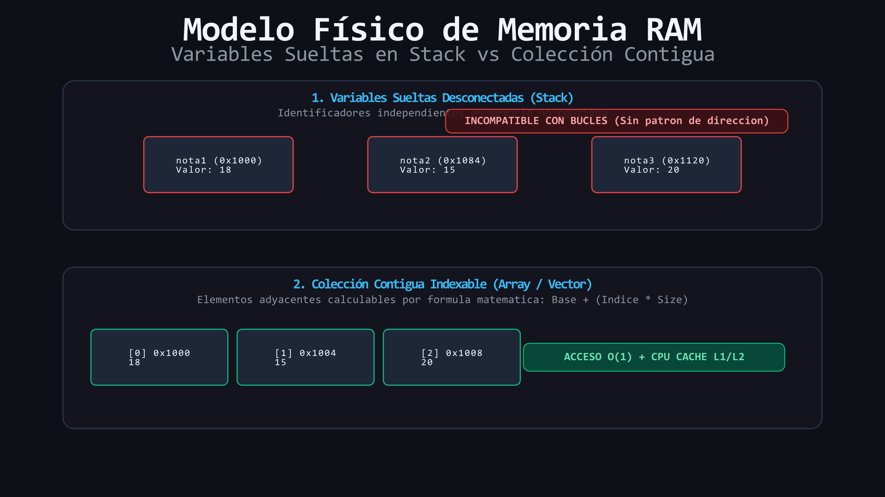
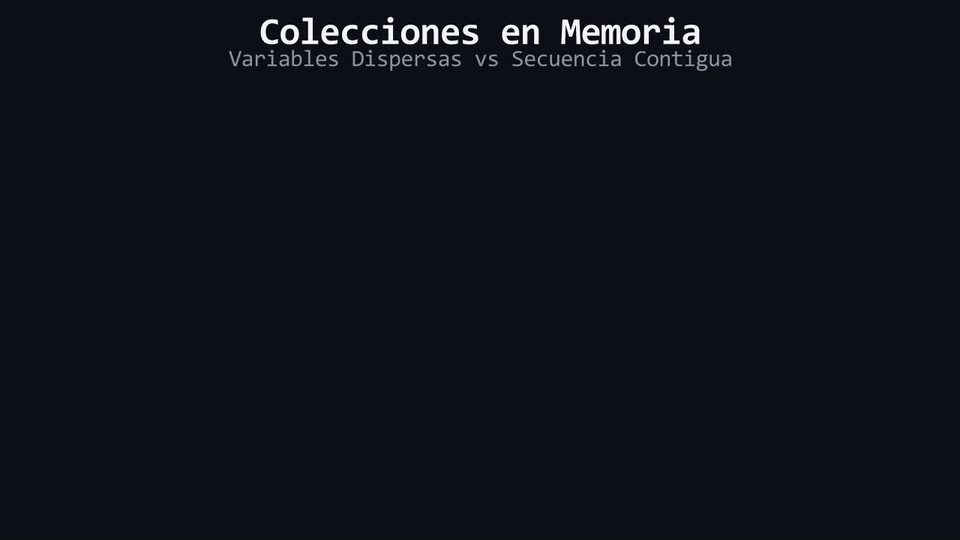

# L01: Límites de las Variables Sueltas vs Colecciones

Imagina que tienes una colección de documentos importantes y decides guardarlos arrojando cada hoja en una mesa diferente de tu casa sin ningún orden ni etiquetado común. Si tienes 3 hojas no parece un gran problema, pero si tienes 500 hojas, buscar un dato o sumarlos todos se convierte en una pesadilla imposible. Inmediatamente dejamos atrás la metáfora de las hojas y mesas para adoptar los términos formales de la ingeniería de software: **Variables primitivas independientes en el Stack** frente a **Estructuras de datos homogéneas en memoria contigua**.

Hasta este punto de nuestro aprendizaje en C++, cuando necesitábamos almacenar información, declarábamos variables individuales:

```cpp
int nota1{18};
int nota2{15};
int nota3{20};
```

Este enfoque funciona exclusivamente para problemas triviales con una cantidad diminuta y fija de datos conocidos de antemano. Sin embargo, en el desarrollo de software real este patrón colapsa rápidamente.

---

## 1. La Inviabilidad de las Variables Sueltas

¿Qué ocurre si deseamos procesar las calificaciones de 50 alumnos, las coordenadas de 10,000 partículas en una simulación física o los puntajes de un torneo?

1. **Explosión Combinatoria de Identificadores:** Tendrías que escribir a mano nombres como `nota1`, `nota2`, `nota3` ... `nota1000`.
2. **Incompatibilidad con Estructuras de Control:** No es posible iterar con un bucle `for` o `while` sobre variables sueltas, ya que cada una posee un identificador distinto e inconexo en el código fuente.
3. **Imposibilidad de Escalar en Tiempo de Ejecución:** Si el usuario decide ingresar 5 notas hoy y 50 notas mañana, un programa basado en variables sueltas no puede adaptarse, pues su número de variables está fijado rígidamente en tiempo de compilación.

<div align="center">
  
</div>

---

## 2. La Solución Arquitectónica: Colecciones Homogéneas

Para resolver este problema, la ciencia de la computación introdujo el concepto de **Colección** o **Arreglo (Array)**: una estructura de datos que agrupa múltiples elementos del **mismo tipo** (homogéneos) alojados de forma **secuencial y contigua en la memoria**.

Al estar ordenados contiguamente en la memoria, podemos acceder a cualquier casilla utilizando un número entero llamado **índice** (*index*), lo que desbloquea la capacidad de recorrer, transformar, filtrar y procesar miles de datos mediante bucles automatizados.

En las siguientes lecciones descubriremos cómo C++ implementa estas colecciones, partiendo desde los arreglos tradicionales heredados de C hasta llegar al estándar moderno: `std::vector`.

<div align="center">
  
</div>

#### 🔍 Traducción Visual a Memoria Física & Hardware:
* **Celdas Rojas Dispersas (`a`, `b`):** Representan variables sueltas asignadas en posiciones arbitrarias del Stack frame, impidiendo la indexación por bucles.
* **Celdas Verdes Contiguas (`notas[0]..[2]`):** Representan una estructura contigua en RAM (`0x1000`, `0x1004`, `0x1008`). Permite acceso directo en $O(1)$ y maximiza el aprovechamiento de la memoria caché del CPU.

---

> 🧪 **Laboratorio:** Comprueba el dolor de calcular promedios con variables sueltas frente a la elegancia de las colecciones. Abre el archivo [`../lab/L01_VariablesSueltas.cpp`](../lab/L01_VariablesSueltas.cpp).

---

> [!WARNING]
> **Regla de oro:** Estas preguntas se pueden responder *solo* con lo que leíste en esta lección. No busques respuestas en librerías avanzadas ni conceptos no vistos.

<details>
<summary><b>1. ¿Por qué es imposible utilizar un bucle para procesar 100 variables declaradas individualmente como <code>nota1</code>, <code>nota2</code>, etc.?</b></summary>

> Porque cada variable posee un identificador sintáctico único e independiente en el código fuente. Un bucle requiere un contenedor indexable o un mecanismo de recorrido secuencial sobre una dirección base común.
</details>

<details>
<summary><b>2. ¿Qué significa que una estructura de datos sea "homogénea" y "contigua en memoria"?</b></summary>

> "Homogénea" significa que todos los elementos almacenados son estrictamente del mismo tipo de dato. "Contigua en memoria" significa que cada elemento reside inmediatamente al lado del anterior en la memoria física sin espacios intermedios vacíos.
</details>

---

| ⬅️ [Anterior: Menú del Módulo](../README.md) | 📖 [Menú del Módulo](../README.md) | ➡️ [Siguiente: L02 — Arreglos de C y Buffer Overflow](L02_CArraysYBufferOverflow.md) |
|:---|:---:|---:|

---

<div align="center">
  <sub>Maintained by <strong>Jesus Vera V. (MiniLux0)</strong> · 2026</sub>
</div>
