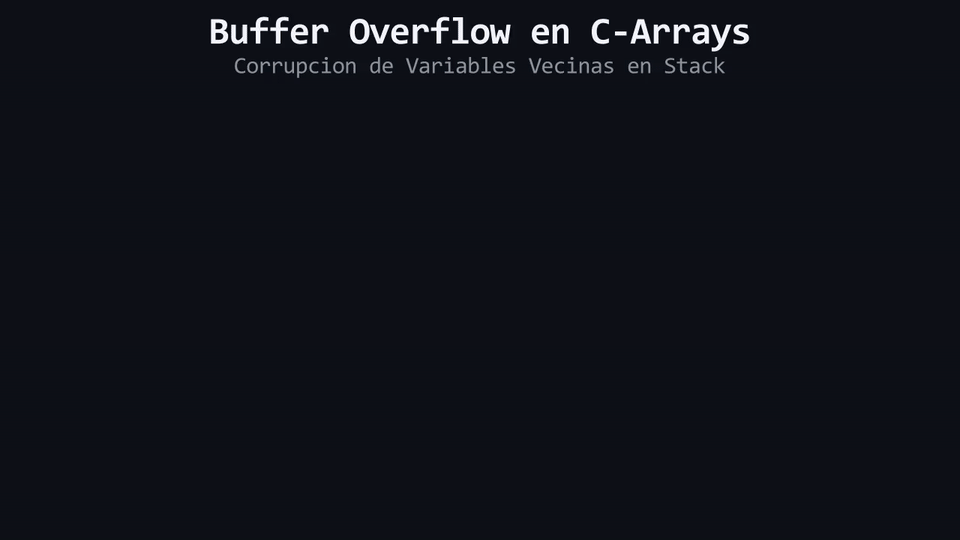

# L02: Arreglos de C (C-Arrays) y el Peligro del Buffer Overflow

Imagina un estacionamiento privado con exactamente 5 casillas numeradas del 0 al 4 delimitadas por muros de ladrillo. Si un conductor distraído ignora las señales e intenta parquear su vehículo en la "casilla número 5", chocará de frente contra el muro y destruirá la oficina que está construida justo detrás del estacionamiento. Dejando atrás los estacionamientos y los autos, entramos de lleno en la arquitectura real del hardware: **Asignación estática en el Stack Frame**, **Acceso sin verificación de límites (Bounds Checking)** y el temido fallo de seguridad conocido como **Buffer Overflow**.

---

## 1. ¿Qué es un Arreglo Tradicional de C (C-Array)?

Heredado del lenguaje C clásico de los años 70, un **C-Array** es la forma más primitiva de agrupar elementos contiguos en memoria:

```cpp
int calificaciones[3]{18, 15, 20}; // Arreglo estático de 3 enteros
```

* **Tamaño Fijo en Compilación:** El número de casillas (3) debe conocerse en tiempo de compilación y no puede crecer ni encogerse jamás.
* **Indexación Base-Cero (0-Indexed):** La primera casilla reside en el índice `0` y la última en `N - 1`. Para un arreglo de tamaño 3, los índices válidos son `0`, `1` y `2`.

```text
MEMORIA STACK (Arreglo de 3 elementos int = 12 bytes):
Índice:             [0]              [1]              [2]
Dirección:       0x7FFD00         0x7FFD04         0x7FFD08
Contenido:     ┌────────────────┬────────────────┬────────────────┐
               │       18       │       15       │       20       │
               └────────────────┴────────────────┴────────────────┘
```

---

## 2. La Anatomía del Desastre: ¿Qué es el *Buffer Overflow*?

Los C-Arrays sufren de una deficiencia crítica de diseño: **no recuerdan su propio tamaño en tiempo de ejecución y no realizan ninguna comprobación de límites**.

Cuando escribes `calificaciones[i]`, el compilador se limita a calcular mecánicamente una dirección física:
```text
Dirección_Destino = Dirección_Base + (i * sizeof(Tipo))
```

Si intentas escribir en un índice fuera de rango, como `calificaciones[3] = 999;` o `calificaciones[10] = 999;`, C++ **no detendrá la ejecución**. En su lugar, el procesador escribirá ciegamente los bytes en esa posición de la memoria RAM:

```text
MEMORIA STACK:
               [0]              [1]              [2]         [FUERA DE RANGO: i=3]
            0x7FFD00         0x7FFD04         0x7FFD08             0x7FFD0C
Contenido:┌────────────────┬────────────────┬────────────────│───────────────────┐
          │       18       │       15       │       20       │ ⚠️ VARIABLE VECINA │
          └────────────────┴────────────────┴────────────────│───────────────────┘
                                                             Sobreescrita con 999
```

Esta escritura ilegal se denomina **Desbordamiento de Búfer (*Buffer Overflow*)**. Sus consecuencias son devastadoras:
1. **Corrupción Silenciosa de Datos:** Sobreescribe variables locales vecinas en el Stack, alterando el comportamiento del programa sin emitir ningún mensaje de error.
2. **Vulnerabilidades de Seguridad:** Históricamente, atacantes maliciosos han aprovechado los desbordamientos de búfer para sobreescribir la dirección de retorno de funciones e inyectar código malicioso en el procesador.
3. **Comportamiento Indefinido (*Undefined Behavior*):** El programa puede continuar corriendo en un estado corrupto, producir resultados erróneos o colapsar con un fallo de segmentación (*Segmentation Fault*).

---

## 3. La Decisión Arquitectónica (ADR 06)

En C++ Moderno, el uso de C-Arrays clásicos (`int arr[N]`) está **terminantemente desaconsejado** en el desarrollo de software profesional. En este curso los estudiamos exclusivamente para comprender la vulnerabilidad física del hardware y valorar la necesidad del contenedor moderno de la biblioteca estándar: `std::vector`.

<div align="center">
  
</div>

#### 🔍 Traducción Visual a Memoria Física & Hardware:
* **Celdas Azules (`arr[0]..[2]`):** Bloque reservado en el Stack frame para el arreglo de tamaño 3.
* **Celda Dorada (`secreta: 100`):** Variable local declarada inmediatamente después en memoria contigua.
* **Láser / Flecha Roja (`arr[3] = 999`):** Acceso fuera de rango sin validación que sobreescribe físicamente la celda vecina, alterando el valor de `secreta` a `999` (*Undefined Behavior*).

---

> 🧪 **Laboratorio:** Observa la sintaxis básica y el funcionamiento de los arreglos contiguos en el Stack. Abre el archivo [`../lab/L02_CArrays.cpp`](../lab/L02_CArrays.cpp).
>
> 🐞 **Demo de Bug:** Ejecuta un Buffer Overflow real y comprueba cómo corrompe la variable adyacente en el Stack. Abre [`../lab/demos/D02_BufferOverflowBug.cpp`](../lab/demos/D02_BufferOverflowBug.cpp).

---

> [!WARNING]
> **Regla de oro:** Estas preguntas se pueden responder *solo* con lo que leíste en esta lección. No busques respuestas en librerías avanzadas ni conceptos no vistos.

<details>
<summary><b>1. Si declaras un arreglo como <code>int datos[5];</code>, ¿cuáles son los índices válidos para acceder a sus elementos?</b></summary>

> Los índices válidos son del `0` al `4` (`0`, `1`, `2`, `3` y `4`). El índice `5` ya se encuentra fuera de los límites del arreglo.
</details>

<details>
<summary><b>2. ¿Por qué un C-Array no emite un error de compilación cuando escribes en una posición fuera de sus límites como <code>datos[10] = 50;</code>?</b></summary>

> Porque el operador de acceso clásico solo realiza un cálculo aritmético de desplazamiento de punteros sin verificar si el índice calculado excede el tamaño asignado al arreglo, provocando una escritura ilegal (Buffer Overflow) y Comportamiento Indefinido.
</details>

---

| ⬅️ [Anterior: L01 — Variables Sueltas vs Colecciones](L01_VariablesSueltasVsColecciones.md) | 📖 [Menú del Módulo](../README.md) | ➡️ [Siguiente: L03 — Vector Estándar Moderno](L03_VectorEstandarModerno.md) |
|:---|:---:|---:|

---

<div align="center">
  <sub>Maintained by <strong>Jesus Vera V. (MiniLux0)</strong> · 2026</sub>
</div>
