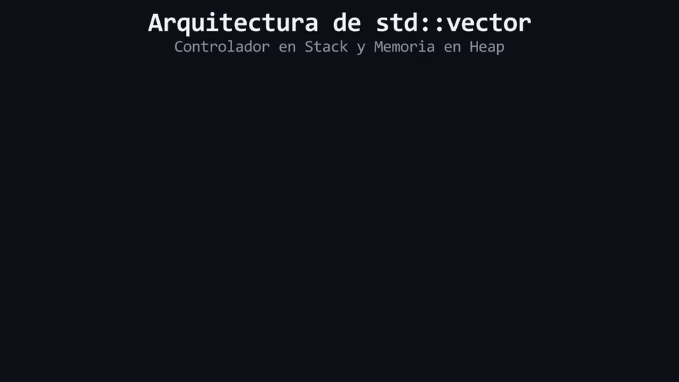

# L03: El Estándar Moderno: `std::vector` y la Memoria Dinámica

Imagina una mochila mágica de explorador: cuando la abres por primera vez tiene el tamaño de un bolsillo, pero cada vez que guardas una nueva herramienta, la tela se expande automáticamente sin romperse para hacer espacio exacto al nuevo objeto. Dejamos atrás las mochilas mágicas para adentrarnos en la ingeniería formal de C++: **Contenedores de secuencia dinámicos**, **Memoria dinámica administrada en el Heap** y la estructura de datos estándar por excelencia: **`std::vector<T>`**.

---

## 1. ¿Qué es `std::vector`?

`std::vector` (disponible incluyendo la cabecera `<vector>`) es el contenedor estándar más importante y utilizado en C++ Moderno. Proporciona una colección contigua de elementos que **puede crecer o encogerse dinámicamente en tiempo de ejecución**, gestionando la memoria automáticamente bajo el principio de RAII (*Resource Acquisition Is Initialization*).

### Arquitectura Interna de Memoria
Un `std::vector` divide su existencia entre dos regiones de la memoria RAM:
1. **En el Stack:** Un objeto de control ultraligero que contiene 3 punteros/valores esenciales: un puntero hacia el inicio de los datos, el tamaño actual (`size`) y la capacidad total (`capacity`).
2. **En el Heap:** El bloque contiguo real donde residen los elementos almacenados.

```text
MEMORIA STACK (Controlador del vector):
┌─────────────────────────┬──────────────┬──────────────────┐
│ Puntero a Datos (Heap)  │ Size: 3      │ Capacity: 4      │
└────────────┬────────────┴──────────────┴──────────────────┘
             │
             ▼
MEMORIA HEAP (Elementos reales en memoria contigua):
┌────────────────┬────────────────┬────────────────┬────────────────┐
│ Elemento [0]   │ Elemento [1]   │ Elemento [2]   │ Espacio Libre  │
│ Valor: 10      │ Valor: 20      │ Valor: 30      │ (Reservado)    │
└────────────────┴────────────────┴────────────────┴────────────────┘
```

---

## 2. Formas de Inicializar un `std::vector`

Para declarar un vector, especificamos el tipo de dato entre los corchetes angulares `<T>` (sintaxis de plantilla o *template*):

```cpp
#include <vector>

// 1. Vector Vacío (size = 0, sin elementos)
std::vector<int> vacio{};

// 2. Inicialización Uniforme con Lista de Valores (size = 3)
std::vector<int> calificaciones{18, 15, 20};

// 3. Inicialización por Conteo (5 casillas inicializadas en 0)
std::vector<int> contador(5);

// 4. Inicialización por Conteo y Valor Específico (4 casillas con valor 100)
std::vector<int> vidas(4, 100);
```

---

## 3. ⚠️ La Gran Trampa: Llaves `{}` vs Paréntesis `()`

Una de las fuentes más comunes de errores sutiles para programadores novatos es confundir la inicialización con llaves `{}` y con paréntesis `()` al trabajar con un solo argumento entero:

```cpp
// Caso A: Llaves {} (Lista de Inicialización)
std::vector<int> vectorA{5}; 
// Resultado: Un vector con 1 SOLO ELEMENTO cuyo valor es 5.
// vectorA.size() == 1  -->  Contenido: [5]

// Caso B: Paréntesis () (Constructor de Tamaño)
std::vector<int> vectorB(5); 
// Resultado: Un vector con 5 ELEMENTOS inicializados por defecto en 0.
// vectorB.size() == 5  -->  Contenido: [0, 0, 0, 0, 0]
```

> [!WARNING]
> Cuando desees especificar la **lista exacta de valores** que contiene el vector, usa siempre **llaves `{}`**. Si deseas reservar una **cantidad determinada de casillas vacías o repetidas**, usa **paréntesis `()`**.

<div align="center">
  
</div>

#### 🔍 Traducción Visual a Memoria Física & Hardware:
* **Panel Superior (Stack Frame):** Objeto de control local que almacena el puntero al buffer dinámico (`ptr: 0x5000`), la cantidad de elementos activos (`size: 3`) y el espacio reservado (`cap: 3`).
* **Flecha Dorada:** Puntero interno que apunta directamente a la dirección física asignada en el Heap.
* **Panel Inferior (Heap Dinámico):** Celdas verdes contiguas donde residen los datos (`10, 20, 30`). Al finalizar el ciclo de vida del vector, el destructor del Stack ejecuta `delete[]` automáticamente, garantizando cero fugas de memoria (RAII).

---

> 🧪 **Laboratorio:** Experimenta con las diversas formas de inicializar vectores en memoria. Abre el archivo [`../lab/L03_VectorBasics.cpp`](../lab/L03_VectorBasics.cpp).
>
> 🐞 **Demo de Bug:** Observa el bug arquitectónico derivado de confundir `{5}` con `(5)`. Abre [`../lab/demos/D03_BraceInitBug.cpp`](../lab/demos/D03_BraceInitBug.cpp).
>
> 🏋️ **Ejercicio:** Configura el inventario dinámico de una nave espacial inicializando vectores de forma precisa. Atrévete con el reto en [`../exercise/E03_InventarioDinamico/E03_InventarioDinamico.cpp`](../exercise/E03_InventarioDinamico/E03_InventarioDinamico.cpp).

---

> [!WARNING]
> **Regla de oro:** Estas preguntas se pueden responder *solo* con lo que leíste en esta lección. No busques respuestas en librerías avanzadas ni conceptos no vistos.

<details>
<summary><b>1. ¿Dónde se almacenan físicamente los elementos reales de un <code>std::vector</code> en la memoria RAM?</b></summary>

> Se almacenan de forma contigua en la memoria dinámica (*Heap*), mientras que el objeto que gestiona el puntero, el tamaño y la capacidad reside en el *Stack*.
</details>

<details>
<summary><b>2. ¿Qué diferencia de contenido existe entre <code>std::vector<int> a{3};</code> y <code>std::vector<int> b(3);</code>?</b></summary>

> `a{3}` crea un vector con 1 único elemento con el valor 3 (`size = 1`), mientras que `b(3)` crea un vector con 3 elementos inicializados con el valor 0 (`size = 3`).
</details>

---

| ⬅️ [Anterior: L02 — Arreglos de C y Buffer Overflow](L02_CArraysYBufferOverflow.md) | 📖 [Menú del Módulo](../README.md) | ➡️ [Siguiente: L04 — Acceso Seguro: .at() vs []](L04_AccesoSeguroAtVsSubscript.md) |
|:---|:---:|---:|

---

<div align="center">
  <sub>Maintained by <strong>Jesus Vera V. (MiniLux0)</strong> · 2026</sub>
</div>
