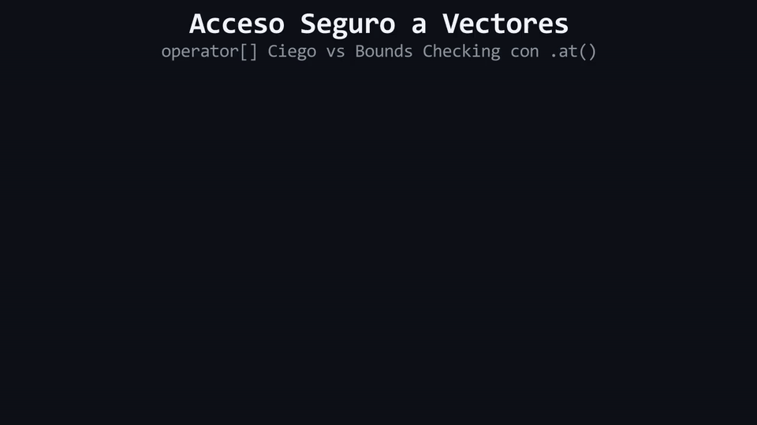

# L04: Acceso Seguro a Elementos: `.at()` vs Operador `[]`

Imagina la entrada a un edificio de máxima seguridad: en una puerta hay un torniquete descompuesto que gira sin importar si muestras una tarjeta válida o un pedazo de cartón en blanco, dejando pasar a intrusos que pueden destruir las oficinas internas; en la otra puerta hay un guardia estricto que escanea biométricamente cada credencial y, ante la menor irregularidad, detiene al intruso y suena una alarma inmediata. Desvanecemos la metáfora de las puertas y los guardias para analizar los mecanismos reales de bajo nivel: **Operador de indexación no comprobado (`operator[]`)**, **Método con verificación de límites (`.at()`)** y la prevención del temido **Undefined Behavior**.

---

## 1. El Doble Camino de Acceso en `std::vector`

`std::vector` ofrece dos formas distintas de acceder y modificar los elementos almacenados en una posición de índice:

1. **El Operador Corchetes (`v[i]`):** Heredado de la filosofía de C, prioriza el rendimiento puro por encima de la seguridad.
2. **El Método Miembro (`v.at(i)`):** Diseñado con la filosofía de robustez y resiliencia de C++ Moderno.

```cpp
std::vector<int> datos{100, 200, 300}; // size = 3 (Índices válidos: 0, 1, 2)

int a = datos[0];    // 100 (Sin comprobación)
int b = datos.at(0); // 100 (Con comprobación de límites)
```

---

## 2. La Trampa Silenciosa de `operator[]`

¿Qué sucede si intentamos acceder a un índice inexistente como `datos[99]` o `datos[3]`?

El operador `[]` **no realiza ninguna verificación de límites (*Bounds Checking*)**. El compilador simplemente calcula la dirección de memoria desplazada y lee o escribe lo que encuentre allí:

```cpp
std::vector<int> datos{100, 200, 300};

// PELIGRO: Acceso fuera de límites silencioso
int valorInvalido = datos[99]; // 💣 UNDEFINED BEHAVIOR
```

Las consecuencias de este acceso ciego son impredecibles:
* Puede leer basura arbitraria de la memoria Heap y propagarla en el sistema.
* Puede corromper otros bloques de memoria dinámicos en el Heap.
* Puede crashear aleatoriamente en producción horas después de haber ocurrido la corrupción de memoria, convirtiendo el bug en un problema casi imposible de depurar.

---

## 3. El Escudo Protector: Método `.at()`

Para eliminar por completo las corrupciones silenciosas de memoria, C++ Moderno introduce el método `.at(indice)`:

```cpp
std::vector<int> datos{100, 200, 300};

int valorSeguro = datos.at(1); // Retorna 200 de forma segura.

// Intento fuera de límites:
int valorInvalido = datos.at(99); 
// 🛡️ DETECCIÓN INMEDIATA: Lanza la excepción std::out_of_range
```

Cuando se invoca `.at(i)`, el vector compara internamente el índice solicitado contra su tamaño actual (`i < size()`). Si el índice es menor que 0 o mayor o igual que `size()`, el método detiene la ejecución inmediatamente y lanza una excepción de tipo `std::out_of_range`.

```text
EVALUACIÓN INTERNA DE .at(i):
¿El índice i es válido (0 <= i < size)?
   ├── SÍ ──> Retorna la referencia al elemento en el Heap.
   └── NO ──> Detiene el flujo y lanza la excepción std::out_of_range.
```

---

## 4. Decisión Arquitectónica (ADR 06)

> [!TIP]
> **Mandamiento Formativo:** En este curso y a lo largo de toda tu formación inicial en C++, está **estrictamente mandatorio el uso de `.at()`** para todo acceso indexado a colecciones. Esto garantiza que cualquier error de cálculo de índices sea detectado y reportado de inmediato.

<div align="center">
  
</div>

#### 🔍 Traducción Visual a Memoria Física & Hardware:
* **Celdas Azules (`[0]..[2]`):** Bloque asignado de 3 elementos válidos en el Heap.
* **Flecha Roja Ciega (`operator[]`):** Salto de memoria sin comprobación previa que accede a direcciones no asignadas (*Undefined Behavior*).
* **Barrera de Protección Verde (`.at()`):** Mecanismo de *Bounds Checking* que evalúa `i < size()` antes de permitir el acceso, detonando una excepción controlada (`std::out_of_range`) ante índices fuera de rango.

---

> 🧪 **Laboratorio:** Compara el comportamiento y rendimiento de `operator[]` frente a `.at()`. Abre el archivo [`../lab/L04_AccesoSeguro.cpp`](../lab/L04_AccesoSeguro.cpp).
>
> 🐞 **Demo de Bug:** Ejecuta un acceso fuera de límites silencioso con `[]` y observa la lectura de memoria basura. Abre [`../lab/demos/D04_SilentOutofBoundsBug.cpp`](../lab/demos/D04_SilentOutofBoundsBug.cpp).
>
> 🏋️ **Ejercicio:** Corrige un sistema de radar espacial que colapsa por accesos ciegos a índices inválidos. Atrévete con el reto en [`../exercise/E04_ElIndicePerdido/E04_ElIndicePerdido.cpp`](../exercise/E04_ElIndicePerdido/E04_ElIndicePerdido.cpp).

---

> [!WARNING]
> **Regla de oro:** Estas preguntas se pueden responder *solo* con lo que leíste en esta lección. No busques respuestas en librerías avanzadas ni conceptos no vistos.

<details>
<summary><b>1. ¿Por qué <code>vector[i]</code> no comprueba si el índice <code>i</code> está dentro del rango válido?</b></summary>

> Porque fue diseñado para priorizar la velocidad máxima de ejecución sin sobrecarga (*zero-overhead*) en algoritmos donde el programador ya ha demostrado matemáticamente que el índice es seguro.
</details>

<details>
<summary><b>2. ¿Qué acción ejecuta el método <code>vector.at(i)</code> cuando se le envía un índice fuera de rango?</b></summary>

> Interrumpe la operación y lanza una excepción estándar de tipo `std::out_of_range`, evitando que se lea o escriba en memoria corrupta.
</details>

---

| ⬅️ [Anterior: L03 — Vector Estándar Moderno](L03_VectorEstandarModerno.md) | 📖 [Menú del Módulo](../README.md) | ➡️ [Siguiente: L05 — Atrapando la Bomba: try / catch](L05_AtrapandoLaBombaTryCatch.md) |
|:---|:---:|---:|

---

<div align="center">
  <sub>Maintained by <strong>Jesus Vera V. (MiniLux0)</strong> · 2026</sub>
</div>
