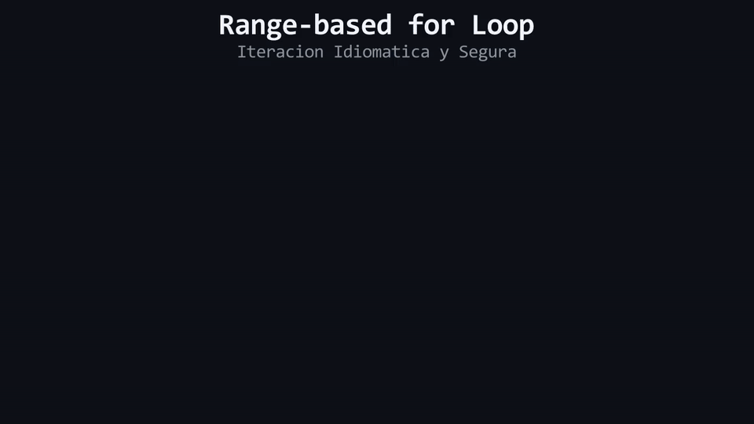

# L06: Recorridos Idiomáticos: El Bucle `range-based for`

Imagina una línea de ensamblaje en una fábrica donde una cinta transportadora desliza paquetes frente a ti: tú solo necesitas tomar cada paquete que llega, sellarlo y dejarlo pasar, sin necesidad de calcular con un cronómetro ni contar con los dedos cuántos centímetros avanzó la cinta desde el inicio. Desvanecemos la metáfora de la fábrica y la cinta para estudiar la ingeniería del lenguaje: **Recorridos secuenciales en memoria contigua**, **Eliminación del estado auxiliar de índices** y la sintaxis moderna del **`range-based for`**.

---

## 1. El Dolor del Bucle `for` Clásico con Índices

En C clásico y C++ tradicional, para recorrer un vector era obligatorio declarar y gestionar una variable de índice manual:

```cpp
std::vector<int> puntajes{15, 30, 45, 60};

// Bucle tradicional basado en índices
for (std::size_t i{0}; i < puntajes.size(); ++i) {
    std::cout << puntajes.at(i) << '\n';
}
```

Aunque funcional, este patrón acarrea múltiples desventajas:
1. **Verbosidad Innecesaria:** Obliga a inicializar un contador, comprobar el límite y realizar un incremento en cada iteración.
2. **Alertas de Tipos (Signed vs Unsigned):** Si declaras `int i = 0;`, el compilador emitirá una advertencia (`-Wsign-compare`) al compararlo contra `.size()` (que retorna `std::size_t`, un entero sin signo).
3. **El Error *Off-By-One*:** El error más común en la historia del software ocurre cuando un programador escribe accidentalmente `<=` en lugar de `<`, intentando acceder a `puntajes.size()`, detonando un fallo de límites.

---

## 2. La Solución Idiomática: `range-based for`

Introducido a partir de C++11 y perfeccionado en C++17, el bucle **`range-based for`** elimina por completo la necesidad de variables de índice para recorridos secuenciales:

```cpp
std::vector<int> puntajes{15, 30, 45, 60};

// Recorrido Idiomático Moderno
for (int puntaje : puntajes) {
    std::cout << puntaje << '\n';
}
```

### Anatomía de la Sintaxis
```text
for ( TipoElemento variableLocal : Contenedor )
      └──────┬─────┘ └──────┬─────┘   └────┬────┘
             │              │              │
    Tipo de cada casilla    │     El vector que deseamos
                            │     recorrer
                     Nombre de la copia
                     en cada ciclo
```

### ¿Cómo Opera Internamente?
En cada iteración del bucle:
1. El compilador obtiene automáticamente el elemento actual de la memoria contigua.
2. Copia su valor dentro de la variable local `puntaje`.
3. Ejecuta el cuerpo del bucle.
4. Avanza a la siguiente posición contigua hasta agotar todos los elementos del vector.
5. **Cero posibilidad de desbordamiento de límites o errores de desfase.**

---

## 3. ¿Cuándo Usar Cada Bucle?

* **Usa `range-based for` (Predeterminado):** Cuando necesites leer o procesar todos los elementos secuencialmente sin importar en qué número de índice reside cada uno.
* **Usa bucle `for` tradicional con `.at(i)`:** Exclusivamente cuando la posición numérica del índice sea fundamental para la lógica del algoritmo (por ejemplo, emparejar dos vectores distintos por su índice compartido).

<div align="center">
  
</div>

#### 🔍 Traducción Visual a Memoria Física & Hardware:
* **Celdas Azules (`10, 20, 30`):** Bloque secuencial en el Heap procesado de izquierda a derecha.
* **Cursor Dorado (`n = ...`):** Variable de copia local que recibe el valor del elemento actual en cada ciclo del bucle.
* **Avance Automático de Puntero:** El compilador gestiona el inicio y final del rango sin intervención de índices manuales (`size_t i`), erradicando los errores *Off-by-One* y accesos fuera de rango.

---

> 🧪 **Laboratorio:** Compara el recorrido clásico con índices frente al `range-based for`. Abre el archivo [`../lab/L06_RangeFor.cpp`](../lab/L06_RangeFor.cpp).
>
> 🐞 **Demo de Bug:** Observa cómo un error *Off-By-One* destruye un bucle tradicional. Abre [`../lab/demos/D06_OffByOneBug.cpp`](../lab/demos/D06_OffByOneBug.cpp).
>
> 🏋️ **Ejercicio:** Refactoriza el motor de telemetría de una estación espacial eliminando bucles con índices vulnerables. Atrévete con el reto en [`../exercise/E06_IteracionSegura/E06_IteracionSegura.cpp`](../exercise/E06_IteracionSegura/E06_IteracionSegura.cpp).

---

> [!WARNING]
> **Regla de oro:** Estas preguntas se pueden responder *solo* con lo que leíste en esta lección. No busques respuestas en librerías avanzadas ni conceptos no vistos.

<details>
<summary><b>1. ¿Por qué el bucle <code>range-based for</code> es inmune a los errores de tipo *Off-By-One*?</b></summary>

> Porque no requiere una condición de parada manual con operadores como `<` o `<=`; el compilador gestiona de forma determinista el inicio y el fin exacto de la memoria contigua del contenedor.
</details>

<details>
<summary><b>2. Si modificas el valor de la variable local dentro de <code>for (int x : miVector) { x = 0; }</code>, ¿cambia el valor en el vector original?</b></summary>

> No, porque en esa sintaxis `x` recibe una copia independiente por valor del elemento. El elemento original en el Heap permanece inalterado.
</details>

---

| ⬅️ [Anterior: L05 — Atrapando la Bomba: try / catch](L05_AtrapandoLaBombaTryCatch.md) | 📖 [Menú del Módulo](../README.md) | ➡️ [Siguiente: L07 — Métodos Esenciales de Vector](L07_MetodosEsencialesVector.md) |
|:---|:---:|---:|

---

<div align="center">
  <sub>Maintained by <strong>Jesus Vera V. (MiniLux0)</strong> · 2026</sub>
</div>
