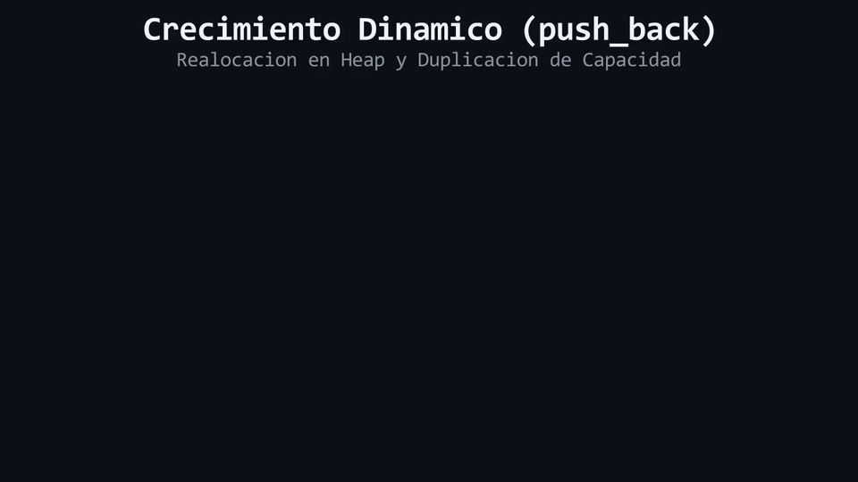

# L07: Métodos Dinámicos: `.push_back()`, `.size()`, `.empty()` y `.reserve()`

Imagina un vaso de vidrio graduado: tiene un nivel actual de agua que indica cuánto líquido contiene en este momento, pero también tiene una marca superior que define la capacidad total del recipiente antes de que el líquido se desborde y te obligue a buscar una jarra más grande para mudar todo el contenido. Dejamos los vasos y las jarras para examinar los conceptos de bajo nivel: **Tamaño actual (`size`) frente a Capacidad reservada (`capacity`)**, **Realocación de memoria en el Heap** y la optimización de rendimiento con **`.reserve()`**.

---

## 1. El Catálogo de Métodos Esenciales

`std::vector` ofrece una rica interfaz de métodos miembro para manipular la colección en tiempo de ejecución:

```cpp
#include <iostream>
#include <vector>

int main() {
    std::vector<int> datos{};

    // 1. Inserción Dinámica al Final: .push_back()
    datos.push_back(10);
    datos.push_back(20);
    datos.push_back(30);

    // 2. Consulta de Cantidad de Elementos: .size()
    std::cout << "Tamano: " << datos.size() << '\n'; // Imprime 3

    // 3. Verificación de Colección Vacía: .empty()
    if (!datos.empty()) {
        std::cout << "El vector contiene elementos.\n";
    }

    // 4. Extremos de la Colección: .front() y .back()
    std::cout << "Primer elemento: " << datos.front() << '\n'; // 10
    std::cout << "Ultimo elemento: " << datos.back() << '\n';  // 30

    // 5. Eliminación del Último Elemento: .pop_back()
    datos.pop_back(); // Remueve el 30; size pasa a 2

    // 6. Vaciado Completo: .clear()
    datos.clear(); // size pasa a 0
    return 0;
}
```

> [!TIP]
> **Buena Práctica:** Prefiere siempre `if (datos.empty())` en lugar de `if (datos.size() == 0)`. El método `.empty()` expresa la intención de forma semántica y directa.

---

## 2. La Mecánica Oculta: `size` vs `capacity`

Para entender la eficiencia de un vector, debemos distinguir claramente estos dos conceptos:
* **`size` (Tamaño):** El número de elementos válidos que existen actualmente en el vector.
* **`capacity` (Capacidad):** El número máximo de elementos que el vector puede almacenar en su bloque actual del Heap **sin necesidad de pedir más memoria al sistema operativo**.

```text
ESTADO DE UN VECTOR (size = 3, capacity = 4):
Heap: [ 10 | 20 | 30 | (Libre) ]
        ▲              ▲
        └─ size = 3 ───┴─ capacity = 4 ─┘
```

---

## 3. ¿Qué es la Realocación en el Heap (*Heap Reallocation*)?

Cuando insertas un nuevo elemento con `.push_back()` y el vector ya alcanzó su capacidad máxima (`size == capacity`):
1. El vector solicita al sistema operativo un **nuevo bloque contiguo más grande en el Heap** (usualmente el doble del tamaño anterior).
2. **Copia/mueve** todos los elementos existentes desde el bloque viejo hacia el bloque nuevo.
3. **Libera** el bloque viejo de memoria.
4. Inserta el nuevo elemento en el bloque recién creado.

```text
PROCESO DE REALOCACIÓN:
1. Bloque viejo lleno (cap: 2):   [ 10 | 20 ]
2. Reserva bloque nuevo (cap: 4): [    |    |    |    ]
3. Migración de datos:           [ 10 | 20 | 30 |    ]
4. Destrucción del bloque viejo.
```

---

## 4. Optimización con `.reserve()`

Si sabes de antemano que vas a insertar, por ejemplo, 10,000 elementos en un vector, llamar a `.push_back()` 10,000 veces provocará múltiples realocaciones y migraciones sucesivas en el Heap, degradando el rendimiento.

El método `.reserve(N)` reserva espacio en el Heap de un solo golpe, asignando la capacidad deseada por adelantado:

```cpp
std::vector<int> lecturasSensor{};
lecturasSensor.reserve(1000); // Asigna capacidad para 1000 elementos de una sola vez.

// Las siguientes 1000 inserciones tendrán costo cero de realocación:
for (int i{0}; i < 1000; ++i) {
    lecturasSensor.push_back(i);
}
```

<div align="center">
  
</div>

#### 🔍 Traducción Visual a Memoria Física & Hardware:
* **Bloque A Superior (Capacidad 2):** Espacio contiguo inicial saturado con los elementos `10` y `20`.
* **Bloque B Inferior (Capacidad 4):** Nueva reserva en el Heap de tamaño duplicado para amortizar el costo de inserción.
* **Migración y Liberación:** Los elementos existentes se transfieren al nuevo bloque contiguo, se inserta el valor `30` y el Bloque A es destruido inmediatamente con `delete[]` para evitar fugas.

---

> 🧪 **Laboratorio:** Inspecciona el crecimiento de `size` y `capacity` en tiempo real. Abre el archivo [`../lab/L07_MetodosVector.cpp`](../lab/L07_MetodosVector.cpp).
>
> 🏋️ **Ejercicio:** Optimiza un sistema de registro de pasajeros para una aerolínea utilizando `.reserve()` y `.push_back()`. Atrévete con el reto en [`../exercise/E07_CreciendoVectores/E07_CreciendoVectores.cpp`](../exercise/E07_CreciendoVectores/E07_CreciendoVectores.cpp).

---

> [!WARNING]
> **Regla de oro:** Estas preguntas se pueden responder *solo* con lo que leíste en esta lección. No busques respuestas en librerías avanzadas ni conceptos no vistos.

<details>
<summary><b>1. ¿Qué diferencia técnica existe entre <code>datos.size()</code> y <code>datos.capacity()</code>?</b></summary>

> `size()` indica la cantidad de elementos que actualmente contiene el vector, mientras que `capacity()` indica cuántos elementos caben en el bloque de memoria actual del Heap antes de que se requiera una realocación.
</details>

<details>
<summary><b>2. ¿Modifica el método <code>datos.reserve(100)</code> el valor de <code>datos.size()</code>?</b></summary>

> No. `reserve()` solo aumenta la capacidad de memoria reservada en el Heap (`capacity`), pero el número de elementos accesibles (`size`) permanece inalterado.
</details>

---

| ⬅️ [Anterior: L06 — Range-based for](L06_RangeBasedFor.md) | 📖 [Menú del Módulo](../README.md) | ➡️ [Siguiente: L08 — Arquitectura Multi-Archivo](L08_ArquitecturaMultiArchivo.md) |
|:---|:---:|---:|

---

<div align="center">
  <sub>Maintained by <strong>Jesus Vera V. (MiniLux0)</strong> · 2026</sub>
</div>
