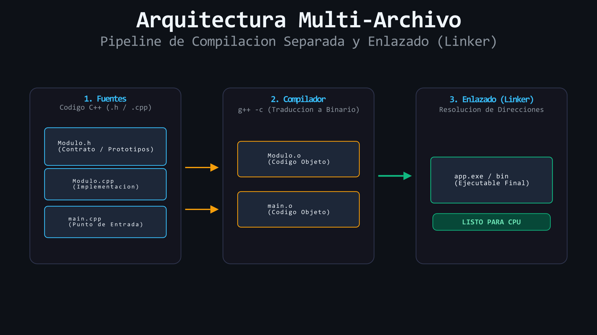

# L08: Arquitectura Multi-Archivo: Separación en `.h`, `.cpp` y `#pragma once`

Imagina el plano de diseño de una casa: el arquitecto dibuja un plano en papel donde muestra qué habitaciones existen, dónde van las puertas y qué dimensiones tienen, para que cualquiera pueda entender el diseño general sin tener que mirar los cables eléctricos ni los ladrillos individuales de la pared. Desvanecemos la metáfora de los planos y la construcción para adoptar los estándares profesionales de la ingeniería de software: **Declaración frente a Definición**, **Archivos de cabecera (*Headers .h*)**, **Unidades de traducción (*.cpp*)**, **Guardas de inclusión con `#pragma once`** y el proceso de **Compilación y Enlace (*Linking*)**.

---

## 1. El Colapso de los Archivos Monolíticos

Hasta ahora, todo nuestro código ha vivido dentro de un único archivo `main.cpp`. En proyectos de ingeniería reales con decenas de miles de líneas de código, escribir todo en un solo archivo produce un código inmanejable, difícil de probar y que no permite la reutilización de funciones.

La arquitectura estándar de la industria en C++ divide el código en dos tipos de archivos complementarios:

1. **Archivos de Cabecera (`.h` o `.hpp`):** Contienen la **interfaz pública** (declaraciones de funciones, prototipos y tipos). Responden a la pregunta: *¿Qué servicios ofrece este módulo?*
2. **Archivos de Implementación (`.cpp`):** Contienen el **código ejecutable** (definición del cuerpo de las funciones). Responden a la pregunta: *¿Cómo se ejecutan esos servicios internamente?*

---

## 2. Estructura de un Módulo Multi-Archivo

Veamos un ejemplo creando un módulo de cálculo de estadísticas:

### Paso 1: El Header (`Estadisticas.h`)
```cpp
#pragma once // 🛡️ Guarda de inclusión obligatoria
#include <vector>

// Declaración del prototipo de la función
double calcularPromedio(const std::vector<double>& notas);
```

> [!IMPORTANT]
> **¿Qué hace `#pragma once`?** Es una directiva de preprocesador estándar que le ordena al compilador incluir este archivo de cabecera **exactamente una sola vez** por unidad de traducción, evitando errores de redefinición de símbolos.

### Paso 2: La Implementación (`Estadisticas.cpp`)
```cpp
#include "Estadisticas.h" // Se incluyen las declaraciones con comillas dobles ""

double calcularPromedio(const std::vector<double>& notas) {
    if (notas.empty()) {
        return 0.0;
    }
    double suma{0.0};
    for (double nota : notas) {
        suma += nota;
    }
    return suma / static_cast<double>(notas.size());
}
```

### Paso 3: El Consumidor Principal (`main.cpp`)
```cpp
#include <iostream>
#include <vector>
#include "Estadisticas.h" // Incluimos solo la interfaz

int main() {
    std::vector<double> misNotas{18.5, 14.0, 19.0};
    double promedio = calcularPromedio(misNotas);

    std::cout << "Promedio obtenido: " << promedio << '\n';
    return 0;
}
```

---

## 3. ¿Cómo se Compila un Proyecto Multi-Archivo?

Para generar el binario ejecutable final, el compilador procesa cada archivo `.cpp` por separado y luego el **Enlazador (*Linker*)** fusiona los objetos en el ejecutable final:

```bash
g++ -std=c++17 -Wall -Wextra Estadisticas.cpp main.cpp -o app
./app
```

<div align="center">
  
</div>

#### 🔍 Traducción Visual del Pipeline de Compilación:
* **Fuentes (`.h` / `.cpp`):** La cabecera define el contrato público mientras cada archivo `.cpp` implementa la lógica o consume la interfaz.
* **Unidades de Traducción (`.o`):** El compilador procesa cada archivo `.cpp` independientemente generando código objeto binario intermedio.
* **Enlazador (*Linker*):** Ensambla todos los archivos `.o` y las funciones de la biblioteca estándar de C++ para producir el ejecutable final (`app.exe`).

---

> 🧪 **Laboratorio:** Explora un proyecto multi-archivo funcional y compílalo desde la terminal. Abre [`../lab/L08_MultiArchivo/main.cpp`](../lab/L08_MultiArchivo/main.cpp).
>
> 🏋️ **Ejercicio:** Separa una biblioteca de utilidades de vectores monolítica en su respectivo `VectorUtils.h` y `VectorUtils.cpp`. Atrévete con el reto en [`../exercise/E08_RefactorizacionHeader/E08_RefactorizacionHeader.cpp`](../exercise/E08_RefactorizacionHeader/E08_RefactorizacionHeader.cpp).

---

> [!WARNING]
> **Regla de oro:** Estas preguntas se pueden responder *solo* con lo que leíste en esta lección. No busques respuestas en librerías avanzadas ni conceptos no vistos.

<details>
<summary><b>1. ¿Por qué es fundamental incluir la directiva <code>#pragma once</code> al inicio de todo archivo <code>.h</code>?</b></summary>

> Para evitar que el archivo de cabecera sea procesado múltiples veces si es incluido por diferentes archivos del proyecto, lo que generaría errores de compilación por redefinición de símbolos.
</details>

<details>
<summary><b>2. ¿Qué diferencia existe entre incluir un archivo con comillas <code>#include "MiHeader.h"</code> y con corchetes angulares <code>#include &lt;vector&gt;</code>?</b></summary>

> Las comillas `""` le indican al preprocesador buscar primero en las carpetas locales de nuestro propio proyecto, mientras que `< >` indica buscar en las rutas estándar del sistema y del compilador.
</details>

---

| ⬅️ [Anterior: L07 — Métodos Esenciales de Vector](L07_MetodosEsencialesVector.md) | 📖 [Menú del Módulo](../README.md) | ➡️ [Siguiente: L09 — Mini-proyecto Calificaciones](L09_MiniProyectoCalificaciones.md) |
|:---|:---:|---:|

---

<div align="center">
  <sub>Maintained by <strong>Jesus Vera V. (MiniLux0)</strong> · 2026</sub>
</div>
