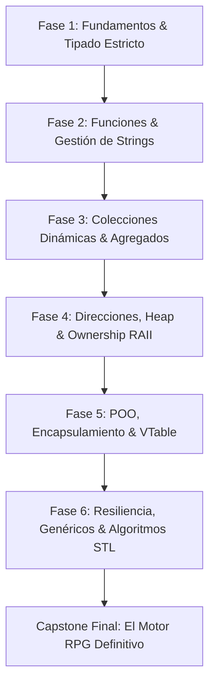

# 📜 Syllabus Oficial del Programa de Especialización en C++ Moderno
### **LearningCpp — De Cero Absoluto a C++ Moderno: Fundamentos de Grado Profesional**
**Estándar Oficial:** ISO/IEC 14882:2017 (C++17 Base con bloques de Evolución a C++20)  
**Autor & Dirección Pedagógica:** Jesus Vera V. (MiniLux0) · **Comunidad:** [Discord Code Lab](https://discord.gg/JExCwZ3YyC)

---

<div align="center">

[](README.md)
[](web/index.html)
[](docs/ARCHITECTURE.md)
[](docs/BACKLOG.md)
[](LearningCpp_Syllabus_Oficial.pdf)

</div>

---

## 🏛️ 1. Ficha Técnica y Descripción del Programa

| Parámetro | Especificación Oficial |
| :--- | :--- |
| **Denominación** | *Especialización Integral en C++ Moderno y Arquitectura de Sistemas* |
| **Programa Oficial** | `LearningCpp: Modern C++ Systems Programming` |
| **Nivel** | Progresión estructurada: De *Cero Absoluto* (Nivel 1) a *Fundamentos de Grado Profesional* (Nivel 6) |
| **Estándar de Referencia** | C++17 (Estándar Base Oficial) con Puentes Comparativos de Evolución a C++20 |
| **Duración Estimada** | 15 Módulos · 6 Fases Estratégicas · 117 Lecciones Teórico-Prácticas |
| **Toolchain Oficial** | `g++ >= 13.0` (MSYS2 UCRT64 / Linux) o `Clang++ >= 16.0` (Apple Clang / LLVM) |
| **Flags de Compilación** | `-std=c++17 -Wall -Wextra -Wpedantic -Wconversion -Wshadow -O2` |
| **Prerrequisitos** | Ninguno. Se asume cero experiencia previa en C++ o programación estructurada. |

---

## 🎯 2. Resultados de Aprendizaje y Competencias Profesionales (RA)

Al completar satisfactoriamente este programa de estudios, el estudiante habrá desarrollado las siguientes competencias de ingeniería:

* **RA1 — Modelo Físico de Memoria:** Comprender con exactitud quirúrgica la distribución de bytes en la memoria física (RAM), diagnosticando los ciclos de vida en el *Stack* frente a la asignación en el *Heap*, y trazando direcciones hexadecimales (`0x...`).
* **RA2 — Gestión Determinista de Recursos (RAII):** Dominar la propiedad estricta de memoria mediante punteros inteligentes (`std::unique_ptr`), eliminando por completo fugas de memoria (*Memory Leaks*), punteros colgantes (*Dangling Pointers*) y accesos inválidos (*Use-After-Free*).
* **RA3 — Arquitectura Orientada a Objetos Segura:** Diseñar clases encapsuladas con constructores seguros (*Member Initializer List*), despacho dinámico mediante tabla virtual (`__vptr`/`VTable`), destructores virtuales obligatorios y blindaje contra *Object Slicing*.
* **RA4 — Resiliencia y Manejo de Errores:** Implementar estrategias de manejo de excepciones basadas en el desenrollado de pila (*Stack Unwinding*), optimizaciones de relocalización con `noexcept` y modelado funcional de ausencias mediante `std::optional`.
* **RA5 — Programación Genérica y Metaprogramación:** Construir plantillas monomórficas evaluadas en tiempo de compilación con cero costo en runtime, buffers estáticos mediante parámetros no-tipo (NTTP) y funciones anónimas (*Lambdas*).
* **RA6 — Computación Declarativa y Algoritmos STL:** Utilizar algoritmos estándar de la STL (`<algorithm>`) para transformaciones, búsquedas y filtros cuando aporten máxima expresividad y seguridad, combinándolos con `range-for` idiomáticos para recorridos secuenciales directos.

---

## 🧠 3. Metodología Pedagógica: Los 4 Pilares Inquebrantables

| Pilar | Definición Técnica | Enfoque Pedagógico |
|:---|:---|:---|
| **1. Principio de la Escalera** | Progresión estrictamente acumulativa | Cero saltos de conocimiento. Cada lección se apoya exclusivamente en conceptos explicados previamente. |
| **2. Break-First, Fix-Later** | Diagnóstico intencional de fallos | Cada característica moderna resuelve un problema clásico. El alumno detona el fallo real antes de la solución. |
| **3. Modelos Mentales de RAM** | Arquitectura física de hardware | Diagramas y animaciones físicas de *Stack*, *Heap*, direcciones hexadecimales, registros y *VTable*. |
| **4. Scaffolding & Fading** | Terminología rigurosa de la industria | Analogías intuitivas iniciales que se desvanecen de inmediato hacia la jerga técnica profesional. |

### El Ciclo Didáctico de Cada Lección:
Cada tema del curso sigue rigurosamente el siguiente flujo formativo:
1. 📖 **Teoría con Modelos Mentales (`theory/`):** Explicación del problema físico, modelo de hardware y sintaxis limpia.
2. 💻 **Laboratorio de Exploración (`lab/`):** Código fuente ejecutable y comentado paso a paso.
3. 🐞 **Demo de Bug Intencional (`lab/demos/`):** Trampas reales del lenguaje detonadas a propósito (*Buffer Overflow*, *Undefined Behavior*, *Narrowing Conversions*, *Use-After-Free*).
4. 🛠️ **Retos Prácticos de Programación (`exercise/`):** Ejercicios de depuración y construcción con validación automatizada.
5. 📌 **Hoja de Síntesis Profesional (`summary/`):** Resumen ejecutivo con reglas de oro y tablas de decisión rápida.

---

## ⏱️ 4. Estimación de Carga Horaria y Grafo de Dependencias

### 4.1. Carga Horaria Sugerida (Workload)
* **Ruta Regular (Semestral):** 16 semanas (dedicación estimada de 6 a 8 horas por semana).
* **Ruta Intensiva (Bootcamp):** 8 semanas (dedicación estimada de 12 a 15 horas por semana).
* **Desglose de Horas por Fase:**
  * **Fase 1 (Fundamentos I/O y Tipos):** ~15 horas
  * **Fase 2 (Funciones y Textos):** ~12 horas
  * **Fase 3 (Colecciones y Structs):** ~18 horas
  * **Fase 4 (Memoria Física y RAII):** ~20 horas
  * **Fase 5 (POO y Polimorfismo):** ~25 horas
  * **Fase 6 (Resiliencia, Templates y STL):** ~30 horas

### 4.2. Grafo de Dependencias de Conocimiento


---

## 📊 5. Rúbricas de Dominio por Niveles

* **Nivel Aprendiz (Fases 1–2):** Manipulación segura de streams `cin`/`cout`, prevención de narrowing con inicialización uniforme `{}`, casting explícito seguro con `static_cast` y aislamiento de stack frames en funciones por valor.
* **Nivel Intermedio (Fases 3–4):** Dominio de arreglos dinámicos contiguos con `std::vector` y límites verificados con `.at()`, paso de parámetros eficiente *Zero-Copy* con `const &`, comprensión física del Heap y gestión de memoria con `std::unique_ptr` garantizando cero fugas de memoria (*Memory Leaks*).
* **Nivel Avanzado (Fases 5–6):** Jerarquías polimórficas robustas con tabla virtual (`VTable`) y destructores virtuales obligatorios, control de flujo tolerante a fallos mediante desenrollado de pila (*Stack Unwinding*), metaprogramación monomórfica con `if constexpr` y pipelines declarativos eficientes con `<algorithm>`.

---

## 🗺️ 6. Matriz General del Plan de Estudios (15 Módulos / 6 Fases)

```text
FASE 1: FUNDAMENTOS
├── M01: Getting Started (7 lecciones) ───────────────> Terminal Interactiva
├── M02: Fundamental Types (7 lecciones) ────────────> Split the Bill Calculator
└── M03: Scope & Control Flow (8 lecciones) ──────────> Taberna RPG / Cajero

FASE 2: FUNCIONES Y TEXTOS
├── M04: Functions (8 lecciones) ─────────────────────> Generador RPG con <random>
└── M05: Constants & Strings (6 lecciones) ───────────> Generador de Contraseñas

FASE 3: COLECCIONES Y ENTIDADES
├── M06: Arrays & Vectors (9 lecciones) ──────────────> Registro de Calificaciones
└── M07: Compound Types (7 lecciones) ────────────────> Bestiario RPG V1

FASE 4: MEMORIA REAL
├── M08: References & Addresses (8 lecciones) ────────> Bestiario V2 (Zero-Copy)
└── M09: Dynamic Memory & RAII (9 lecciones) ─────────> Bestiario V3 (Heap RAII)

FASE 5: POO MODERNA
├── M10: Classes & Encapsulation (10 lecciones) ──────> Bestiario V4 (Encapsulado)
├── M11: Inheritance (7 lecciones) ───────────────────> Jerarquía del Bestiario
└── M12: Polymorphism (8 lecciones) ──────────────────> El Coliseo (Game Loop)

FASE 6: RESILIENCIA, ESPECIALIZACIÓN Y CAPSTONE
├── M13: Error Handling & Resilience (7 lecciones) ───> Motor de Mazmorras
├── M14: Templates & Lambdas (8 lecciones) ───────────> Pipeline de Eventos
└── M15: STL Algorithms & Pipelines (8 lecciones) ────> EL MOTOR RPG DEFINITIVO (Capstone)
```

---

## 📘 7. Temario Detallado Módulo por Módulo

---

### 🔹 FASE 1 — FUNDAMENTOS DE LA COMPUTACIÓN

#### 🚀 [Módulo 01 — Getting Started](01_GettingStarted/)
* **Objetivo:** Comprender la transformación de código fuente a binario ejecutable y dominar la E/S básica en consola.
* **Lecciones (7):**
  * `L00`: ¿Qué es programar? — Filosofía de la compilación y por qué el hardware requiere instrucciones en código máquina.
  * `L01`: Instalando tus herramientas — Verificación con `g++` y comandos de supervivencia en terminal (`cd`, `dir`, `ls`).
  * `L02`: Tu primer programa — Anatomía inmutable de `int main()`, `std::cout` y comando de compilación mínimo.
  * `L03`: Namespaces y el universo `std::` — Por qué escribimos `std::` y el veto a la contaminación global de `using namespace std;`.
  * `L04`: Formato y salida limpia — Salto de línea `'\n'` frente al cuello de botella de `std::endl`.
  * `L05`: Primer contacto con datos — Lectura con `std::cin` y la inicialización uniforme `{0}` contra la basura en RAM.
  * `L06`: Mini-proyecto integrador — *Terminal Interactiva Multi-palabra* con `std::getline` y saneamiento de buffers.
* **Bugs Demostrados:** `D04_UninitializedBug.cpp`, `D05_CinSpacesBug.cpp`.
* **Decisión Arquitectónica (ADR 01):** Prohibición absoluta de `using namespace std;` y `std::endl`.

---

#### 🧱 [Módulo 02 — Fundamental Types](02_FundamentalTypes/)
* **Objetivo:** Conocer la huella de memoria de los tipos primitivos y dominar el sistema de tipado estático de C++.
* **Lecciones (7):**
  * `L01`: Tipos primitivos y Memoria — `int`, `double`, `char`, `bool` y la inspección de bytes físicos con `sizeof`.
  * `L02`: Inicialización Uniforme `{}` — Prevención de *Narrowing Conversions* destructivas frente al operador `=`.
  * `L03`: Operadores aritméticos — Precedencia y el error de cálculo de la división entera truncada (`7 / 2 = 3`).
  * `L04`: Operadores relacionales y lógicos — Compuertas booleanas y prevención del bug `if (x = 5)`.
  * `L05`: Conversión explícita con `static_cast` — Casting seguro en tiempo de compilación para resolver la división entera.
  * `L06`: Deducción con `auto` — Inferencia de tipos idiomática sin perder visibilidad sobre la memoria física.
  * `L07`: Mini-proyecto integrador — *"Split the Bill"*: Calculadora de gastos exactos con alta precisión y casting seguro.
* **Bugs Demostrados:** `D02_NarrowingBug.cpp`, `D03_IntegerDivisionBug.cpp`, `D04_AssignmentInIfBug.cpp`.
* **Decisión Arquitectónica (ADR 02):** Inicialización con llaves `{}` obligatoria en todas las variables.

---

#### 🔀 [Módulo 03 — Scope & Control Flow](03_ScopeAndControlFlow/)
* **Objetivo:** Controlar el flujo de ejecución del programa y gestionar los ciclos de vida de variables en el *Stack*.
* **Lecciones (8):**
  * `L01`: Decisiones con `if / else` — Control de bifurcaciones y la trampa del punto y coma asesino `if (cond);`.
  * `L02`: Cadenas `else if` — Evaluación por cortocircuito y prevención de condiciones inalcanzables (*Unreachable Code*).
  * `L03`: Bloques y Ámbito (*Scope*) — Las llaves `{}` como marcos en el Stack y el bug de *Variable Shadowing*.
  * `L04`: Conmutación con `switch` — Selección múltiple y prevención del error de *Fallthrough* involuntario.
  * `L05`: Bucles condicionales `while / do-while` — Repetición condicional y prevención de bucles infinitos en consola.
  * `L06`: El bucle contador `for` — Inicialización, condición, incremento y el error de desfase *Off-By-One*.
  * `L07`: Control de bucles: `break` y `continue` — Manipulación de flujo y limitaciones en bucles anidados.
  * `L08`: Mini-proyecto integrador — *"Taberna RPG / Cajero Automático"*: Menú resiliente con bucle `while(true)` y `switch`.
* **Bugs Demostrados:** `D01_SemicolonIfBug.cpp`, `D03_ShadowingBug.cpp`, `D04_FallthroughBug.cpp`, `D06_OffByOneBug.cpp`.
* **Decisión Arquitectónica (ADR 03):** Delimitación explícita del ciclo de vida en el Stack mediante llaves `{}`.

---

### 🔹 FASE 2 — FUNCIONES Y TEXTOS

#### 📦 [Módulo 04 — Functions](04_Functions/)
* **Objetivo:** Modularizar código en unidades funcionales atómicas y dominar el paso de parámetros por valor.
* **Lecciones (8):**
  * `L01`: Anatomía de una función — Declaración, definición, parámetros y separación de responsabilidades.
  * `L02`: Retorno de valores — La obligación de retornar valor en todas las ramas lógicas contra el *Undefined Behavior*.
  * `L03`: Funciones `void` — Procedimientos sin retorno y comportamiento ante intentos de captura.
  * `L04`: Parámetros por valor (*Pass-by-value*) — La trampa del clon: demostración de que las funciones reciben copias aisladas.
  * `L05`: Ámbito local y pila de llamadas — Aislamiento total de memoria entre el marco de la función y el `main`.
  * `L06`: Refactorización modular — Descomposición de funciones monolíticas en piezas reutilizables.
  * `L07`: Aleatoriedad moderna con `<random>` — Uso de `std::mt19937` y por qué está terminantemente vetado `rand()`.
  * `L08`: Mini-proyecto integrador — *Generador de Atributos RPG*: Simulador modular con tiradas aleatorias y validación.
* **Bugs Demostrados:** `D02_MissingReturnBug.cpp`, `D04_PassByValueBug.cpp`, `D07_StaticRngBug.cpp`.
* **Decisión Arquitectónica (ADR 04):** Prohibición total de `rand()` y `srand()`; uso exclusivo de `<random>`.

---

#### 📝 [Módulo 05 — Constants & Strings](05_ConstantsAndStrings/)
* **Objetivo:** Implementar la inmutabilidad por defecto y manipular cadenas de texto de forma segura y eficiente.
* **Lecciones (6):**
  * `L01`: Constantes con `const` — Inmutabilidad en tiempo de ejecución (*Const Correctness*).
  * `L02`: Evaluación en compilación con `constexpr` — Cálculos resueltos por el compilador con costo cero en runtime.
  * `L03`: Cadenas dinámicas `std::string` — Gestión automática de tamaño, concatenación y superación de `char[]`.
  * `L04`: Vistas eficientes con `std::string_view` — Paso de texto con costo cero de copia y prevención de *Dangling Views*.
  * `L05`: Saneamiento de `std::cin` — Limpieza y recuperación ante entradas corruptas (`cin.fail()`, `cin.clear()`).
  * `L06`: Mini-proyecto integrador — *Generador de Contraseñas Seguras*: Creación inmutable y validación estricta.
* **Bugs Demostrados:** `D01_MutationBug.cpp`, `D04_DanglingStringViewBug.cpp`, `D05_CinInfiniteLoopBug.cpp`.
* **Decisión Arquitectónica (ADR 05):** Separación conceptual estricta entre `const` (runtime) y `constexpr` (compile-time).

---

### 🔹 FASE 3 — COLECCIONES Y ENTIDADES

#### 🗄️ [Módulo 06 — Arrays & Vectors](06_ArraysAndVectors/)
* **Objetivo:** Gestionar colecciones homogéneas en memoria contigua y migrar a una arquitectura multi-archivo.
* **Lecciones (9):**
  * `L01`: Límites de las variables sueltas — Por qué colapsa el código al procesar datos no estructurados.
  * `L02`: Arreglos de C y *Buffer Overflow* — Demostración física de cómo un desbordamiento corrompe variables vecinas.
  * `L03`: `std::vector` moderno — Inicialización con llaves `{5}` (un valor) vs paréntesis `(5)` (cinco casillas).
  * `L04`: Acceso seguro (`.at()` vs `[]`) — Prevención de *Undefined Behavior* forzando verificación de límites con `.at()`.
  * `L05`: Captura táctica de excepciones — Manejo de `std::out_of_range` con bloques `try / catch`.
  * `L06`: Iteración idiomática con `range-based for` — Recorridos limpios y seguros sin manipulación de índices.
  * `L07`: Métodos dinámicos del vector — `.push_back()`, `.size()`, `.empty()`, `.reserve()` y gestión del Heap.
  * `L08`: Arquitectura Multi-Archivo — Separación profesional en `.h` y `.cpp` con directivas `#pragma once`.
  * `L09`: Mini-proyecto integrador — *Registro de Calificaciones*: Sistema modular de gestión de notas dinámicas.
* **Bugs Demostrados:** `D02_BufferOverflowBug.cpp`, `D03_BraceInitBug.cpp`, `D04_SilentOutofBoundsBug.cpp`.
* **Decisión Arquitectónica (ADR 06):** Uso mandatorio de `.at()` en fases formativas para eliminar fallos silenciosos.

---

#### 🧩 [Módulo 07 — Compound Types](07_CompoundTypes/)
* **Objetivo:** Modelar entidades complejas agrupando datos heterogéneos y estados fuertemente tipados.
* **Lecciones (7):**
  * `L01`: El colapso de firmas extensas — Por qué las funciones con 6 parámetros individuales destruyen el diseño.
  * `L02`: Estructuras con `struct` — Agrupación heterogénea en memoria contigua y operador punto (`.`).
  * `L03`: Inicialización de Agregados y Constructores — Sintaxis `{}` uniforme C++17 y puente comparativo a *Designated Initializers* de C++20.
  * `L04`: El peligro de los números mágicos — Por qué representar estados con enteros causa vulnerabilidades.
  * `L05`: Máquinas de estado con `enum class` — Enumeraciones con ámbito y tipado fuerte para eliminar conversiones implícitas.
  * `L06`: Colecciones de Entidades — Integración armónica de `std::vector<struct>` en memoria contigua.
  * `L07`: Mini-proyecto integrador — *Bestiario RPG V1*: Base de datos en memoria con combate elemental tipado.
* **Bugs Demostrados:** `D02_MissingSemicolonBug.cpp`, `D03_AggregateInitOrderBug.cpp`, `D04_MagicNumberBug.cpp`.
* **Decisión Arquitectónica (ADR 07):** Veto a los `enum` clásicos de C; adopción exclusiva de `enum class`.

---

### 🔹 FASE 4 — ARQUITECTURA DE MEMORIA REAL

#### 🔗 [Módulo 08 — References & Addresses](08_ReferencesAndAddresses/)
* **Objetivo:** Inspeccionar direcciones físicas de memoria y dominar el paso por referencia constante (*Zero-Copy*).
* **Lecciones (8):**
  * `L01`: El costo de la copia innecesaria — Medición de pérdida de rendimiento por clonación de estructuras pesadas.
  * `L02`: Direcciones físicas en RAM (`&`) — Inspección directa de punteros de memoria hexadecimales (`0x...`).
  * `L03`: Paso por Referencia (*Pass-by-Reference*) — Creación de alias directos a la variable original para mutaciones.
  * `L04`: El peligro de la mutación accidental — Cómo las referencias mutables corrompen datos en lecturas.
  * `L05`: La Regla de Oro de C++: Referencias `const &` — Primitivos por valor, tipos pesados por referencia constante.
  * `L06`: La amnesia de `auto` — Por qué `auto x = ref` clona el dato y cómo forzar la referencia con `const auto&`.
  * `L07`: Referencias colgantes (*Dangling References*) — Retorno mortal de referencias a variables locales del Stack.
  * `L08`: Mini-proyecto integrador — *Bestiario V2 (Zero-Copy)*: Refactorización integral con paso eficiente por `const &`.
* **Bugs Demostrados:** `D01_HeavyCloneBug.cpp`, `D04_AccidentalMutationBug.cpp`, `D07_DanglingReferenceBug.cpp`.
* **Decisión Arquitectónica (ADR 08):** Regla de oro estricta: primitivos por valor (`int`, `double`), tipos pesados por `const &`.

---

#### 🧠 [Módulo 09 — Dynamic Memory & Smart Pointers](09_DynamicMemory/)
* **Objetivo:** Comprender la asignación en el *Heap* y aplicar la gestión automática determinista mediante RAII.
* **Lecciones (9):**
  * `L01`: Límite del Stack vs la Inmensidad del Heap — Tamaño físico de los segmentos de memoria y necesidad de memoria dinámica.
  * `L02`: Punteros crudos observadores (`T*`) — Desreferenciación (`*ptr`), operador flecha (`->`) y valor nulo `nullptr`.
  * `L03`: El puntero nulo y *Segmentation Fault* — Detección defensiva de accesos a memoria no inicializada.
  * `L04`: Asignación manual con `new` — Solicitud de memoria en Heap y por qué `new[]` está prohibido en C++ moderno.
  * `L05`: Fugas de Memoria (*Memory Leaks*) — La pérdida silenciosa de recursos por omisión de `delete`.
  * `L06`: Punteros Colgantes (*Dangling Pointers*) — Uso de memoria liberada (*Use-After-Free*).
  * `L07`: La Revolución de RAII y `std::unique_ptr` — Gestión determinista atando el Heap al Stack con `std::make_unique<T>()`.
  * `L08`: Semántica de Movimiento (`std::move`) — Transferencia segura de propiedad única sin duplicar memoria.
  * `L09`: Mini-proyecto integrador — *Bestiario V3 (Heap RAII)*: Entidades dinámicas 100% gobernadas por `std::unique_ptr`.
* **Bugs Demostrados:** `D03_NullPointerCrashBug.cpp`, `D05_MemoryLeakBug.cpp`, `D06_DanglingPointerBug.cpp`.
* **Decisión Arquitectónica (ADR 09):** Veto absoluto a `new[]` y `delete[]`; adopción estricta de RAII con `std::unique_ptr`.

---

### 🔹 FASE 5 — PROGRAMACIÓN ORIENTADA A OBJETOS MODERNA

#### 🏛️ [Módulo 10 — Classes & Encapsulation](10_Classes/)
* **Objetivo:** Blindar invariantes de negocio mediante encapsulamiento estricto y sobrecarga idiomática de operadores.
* **Lecciones (10):**
  * `L01`: El Estado Inconsistente — Por qué los `struct` con campos públicos permiten corromper invariantes lógicas.
  * `L02`: El cerrojo de `class` — Privacidad por defecto, modificadores `private`/`public` y convención `m_`.
  * `L03`: Métodos miembros `const` — Permitir invocaciones seguras desde referencias inmutables (`const &`).
  * `L04`: Getters y Setters seguros — Retorno eficiente por `const &` y validación rigurosa de rangos en mutaciones.
  * `L05`: *Member Initializer List* — Inicialización segura, prevención de `-Wreorder` y calificador `explicit`.
  * `L06`: Principio *"Tell, Don't Ask"* — Cómo evitar que los getters excesivos destruyan el diseño orientado a objetos.
  * `L07`: Sobrecarga de Operadores — Integración con flujos `operator<<` y comparaciones de igualdad `operator==`.
  * `L08`: Clases Multi-Archivo Profesionales — Declaración en `.h` e implementación con `Clase::` en `.cpp`.
  * `L09`: Destructores y el ciclo RAII — Limpieza determinista de recursos al expirar el ciclo de vida del objeto (`~Clase()`).
  * `L10`: Mini-proyecto integrador — *Bestiario V4 (Multi-Archivo)*: Clases POO robustas con operadores y destructores blindados.
* **Bugs Demostrados:** `D01_InconsistentStateBug.cpp`, `D03_ConstMemberFunctionBug.cpp`, `D05_InitOrderBug.cpp`.
* **Decisión Arquitectónica (ADR 10):** Atributos estrictamente privados con prefijo `m_` y constructores con *Member Initializer List*.

---

#### 🧬 [Módulo 11 — Inheritance](11_Inheritance/)
* **Objetivo:** Reutilizar lógica mediante jerarquías IS-A y prevenir la trampa destructiva del *Object Slicing*.
* **Lecciones (7):**
  * `L01`: El anti-patrón de Copiar/Pegar — Costo técnico de duplicar código en clases hermanas.
  * `L02`: Herencia Simple (`: public`) — Relación "Es-Un" (IS-A) y prevención de herencia privada accidental.
  * `L03`: Visibilidad `protected` — Atributos privados protegidos con métodos de acceso controlados.
  * `L04`: Cadenas de Constructores — Delegación obligatoria hacia el constructor base en la lista de inicialización.
  * `L05`: Ciclo de Vida en Jerarquías — Construcción de Padre a Hijo y destrucción inversa de Hijo a Padre.
  * `L06`: La Trampa del Recorte (*Object Slicing*) — Destrucción de datos al guardar derivadas por valor en `std::vector<Base>`.
  * `L07`: Mini-proyecto integrador — *Jerarquía del Bestiario*: Árbol de 3 niveles (`Entidad` → `Monstruo` → `Jefe`).
* **Bugs Demostrados:** `D02b_PrivateInheritanceBug.cpp`, `D04_ConstructorChainBug.cpp`, `D06_ObjectSlicingBug.cpp`.
* **Decisión Arquitectónica (ADR 11):** Prohibición de herencia múltiple de implementación con estado; herencia simple obligatoria.

---

#### 🎭 [Módulo 12 — Polymorphism](12_Polymorphism/)
* **Objetivo:** Implementar despacho dinámico en tiempo de ejecución con tablas virtuales y contratos de interfaz.
* **Lecciones (8):**
  * `L01`: Enlace Estático (*Early Binding*) — Por qué el compilador enlaza al tipo del puntero y no al objeto real.
  * `L02`: Funciones Virtuales (`virtual`) y la VTable — Despacho dinámico a través del puntero de tabla virtual `__vptr`.
  * `L03`: Palabras clave `override` y `final` — Detección temprana de errores de firma y sellado de clases.
  * `L04`: El Destructor Virtual (La Fuga Letal) — Obligatoriedad de `virtual ~Base() = default;` para evitar fugas de memoria.
  * `L05`: Clases Abstractas e Interfaces Puras (`= 0`) — Contratos puros sin estado y herencia múltiple de interfaces.
  * `L06`: Colecciones Polimórficas — `std::vector<std::unique_ptr<Base>>` y downcasting seguro con `dynamic_cast`.
  * `L07`: Impresión Polimórfica — `operator<<` delegando en una función virtual pura `imprimir(std::ostream&) const`.
  * `L08`: Mini-proyecto integrador — *El Coliseo (Bestiario V5)*: Game Loop de combate polimórfico sin bifurcaciones `if/else`.
* **Bugs Demostrados:** `D01_StaticBindingBug.cpp`, `D03_SilentTypoBug.cpp`, `D04_VirtualDestructorLeakBug.cpp`.
* **Decisión Arquitectónica (ADR 12):** Destructor virtual obligatorio (`virtual ~Base() = default;`) en toda clase base polimórfica.

---

### 🔹 FASE 6 — RESILIENCIA, ESPECIALIZACIÓN Y CAPSTONE

#### 🛡️ [Módulo 13 — Error Handling & Resilience](13_ErrorHandling/)
* **Objetivo:** Construir sistemas tolerantes a fallos con *Stack Unwinding*, excepciones de dominio y `std::optional`.
* **Lecciones (7):**
  * `L01`: Fragilidad de los Códigos de Retorno — Por qué retornar enteros o booleanos genera errores ignorados en producción.
  * `L02`: `try`, `throw`, `catch` y *Stack Unwinding* — Destrucción automática de objetos RAII durante el vuelo de una excepción.
  * `L03`: Jerarquía `std::exception` — Captura obligatoria por referencia constante (`catch (const std::exception& e)`).
  * `L04`: Excepciones en Constructores — Abortar la instanciación de objetos en estado inválido ("objetos zombi").
  * `L05`: La Alternativa Ligera: `std::optional` (C++17) — Manejo idiomático de ausencias esperadas con `std::nullopt`.
  * `L06`: La Garantía de `noexcept` — Por qué omitir `noexcept` en constructores de movimiento degrada el rendimiento de `std::vector`.
  * `L07`: Mini-proyecto integrador — *Motor de Mazmorras Resiliente*: Carga de archivos con recuperación ante corrupción de datos.
* **Bugs Demostrados:** `D01_IgnoredReturnCodeBug.cpp`, `D02_RawPointerLeakOnThrowBug.cpp`, `D06_VectorCopyFallbackBug.cpp`.
* **Decisión Arquitectónica (ADR 13):** Captura exclusiva por referencia constante; uso preferente de `std::optional` para ausencias normales.

---

#### 📦 [Módulo 14 — Templates & Lambdas](14_TemplatesAndLambdas/)
* **Objetivo:** Escribir código genérico de alto rendimiento en tiempo de compilación y dominar las funciones anónimas.
* **Lecciones (8):**
  * `L01`: Polimorfismo Estático vs Dinámico — Generación de código monomórfico con costo cero en runtime (*Inlining*).
  * `L02`: Plantillas de Funciones (`template <typename T>`) — Deducción de tipos y plantillas multiparámetro.
  * `L03`: La Trampa del Linker en Templates — Por qué las plantillas deben residir obligatoriamente en archivos de cabecera (`.hpp`).
  * `L04`: Plantillas de Clases y CTAD — Contenedores genéricos con deducción automática de tipos en C++17.
  * `L05`: Parámetros No-Tipo (NTTP) — Buffers estáticos contiguos en el Stack sin tocar el Heap (`template <std::size_t N>`).
  * `L06`: Lambdas Modernas `[](){}` — Funciones anónimas instantáneas como predicados de primer nivel.
  * `L07`: Capturas de Lambdas — Copia `[=]` vs referencia `[&]` y prevención de *Dangling Lambda Captures*.
  * `L08`: Mini-proyecto integrador — *Pipeline Genérico de Eventos*: Bus de eventos desacoplado con templates y lambdas.
* **Bugs Demostrados:** `D02_TemplateDeductionBug.cpp`, `D03_TemplateLinkerBug.cpp`, `D07_DanglingLambdaCaptureBug.cpp`.
* **Decisión Arquitectónica (ADR 14):** Las plantillas deben implementarse obligatoriamente en archivos de cabecera (`.hpp`); se incluye puente a Concepts C++20.

---

#### ⚡ [Módulo 15 — STL Algorithms, Pipelines & Capstone Final](15_STLAlgorithms/)
* **Objetivo:** Dominar los algoritmos estándar declarativos, pipelines funcionales y culminar el Capstone integral del curso.
* **Lecciones (8):**
  * `L01`: Algoritmos STL vs Bucles Manuales — Sustitución de bucles por `std::all_of`, `std::any_of` y `std::count_if` vs `range-for` idiomático.
  * `L02`: Invalidación de Iteradores — Prevención de *Undefined Behavior* mediante el *Erase-Remove Idiom* (con mención a `std::erase_if` de C++20).
  * `L03`: Búsqueda y Predicados — `std::find_if` y `std::min_element` retornando `std::optional`.
  * `L04`: Transformación y Reducción — Mapeo funcional con `std::transform` y reducción acumulativa con `std::accumulate`.
  * `L05`: Ordenamiento Avanzado — `std::sort` con lambdas y comparadores multicriterio personalizados.
  * `L06`: Evolución C++20: Ranges & Views — Evaluación perezosa (*Lazy Evaluation*) con tuberías de composición `|`.
  * `L07`: Concurrencia y Asincronía Básica — Tareas en segundo plano con `std::async` y `std::future`.
  * `L08`: **Capstone Final del Curso: "El Motor RPG Definitivo"** — Proyecto maestro multi-archivo que consolida armónicamente los 15 módulos del plan de estudios: POO polimórfica, RAII con `unique_ptr`, excepciones de dominio, templates, lambdas y algoritmos STL.
* **Bugs Demostrados:** `D01_RawLoopOffByOneBug.cpp`, `D02_IteratorInvalidationBug.cpp`, `D07_DataRaceIntroBug.cpp`.
* **Decisión Arquitectónica (ADR 15):** Privilegiar claridad e idiomaticidad: usar algoritmos de la STL para transformaciones y `range-for` para secuencias directas.

---

## ⚖️ 8. Mandamientos de Codificación y Estándares de Ingeniería

Para garantizar la formación de desarrolladores del más alto calibre técnico, todo el código desarrollado en este curso se rige por las siguientes reglas estrictas:

```text
┌─────────────────────────────────────────────────────────────────────────────────────────┐
│ 1. VETO A "using namespace std;"   │ Escribir siempre el prefijo explícito "std::".     │
│ 2. VETO A "std::endl"              │ Usar exclusivamente el carácter de salto '\n'.     │
│ 3. INICIALIZACIÓN UNIFORME {}      │ Prohibido declarar variables primitivas sueltas.   │
│ 4. VETO A "new[]" Y "delete[]"     │ Gestión de memoria dinámica exclusiva con RAII.    │
│ 5. CONST CORRECTNESS POR DEFECTO   │ Variables y métodos inmutables salvo necesidad.    │
│ 6. VETO A "rand()" / "srand()"     │ Aleatoriedad exclusiva con la librería <random>.   │
│ 7. ACCESO VERIFICADO CON ".at()"   │ Evitar [] no verificado en etapas formativas.      │
│ 8. DESTRUCTOR VIRTUAL OBLIGATORIO  │ virtual ~Base() = default; en toda clase base.     │
│ 9. CLARIDAD ANTE TODO              │ Algoritmos STL para procesar; range-for directo.   │
└─────────────────────────────────────────────────────────────────────────────────────────┘
```

---

## 📚 9. Bibliografía y Recursos de Referencia Recomendados

1. **Bjarne Stroustrup** — *A Tour of C++* (3rd Edition, C++20), Addison-Wesley.
2. **Scott Meyers** — *Effective Modern C++: 42 Specific Ways to Improve Your Use of C++11 and C++14*, O'Reilly Media.
3. **Jason Turner** — *C++ Best Practices: 45ish Ways to Write Better Modern C++* (2nd Edition).
4. **Bjarne Stroustrup & Herb Sutter** — *C++ Core Guidelines* (isocpp.github.io/CppCoreGuidelines).
5. **cppreference.com** — *C++ Reference and Standard Library Documentation*.

---

<div align="center">

### **LearningCpp — Crafted with Precision Engineering**
<sub>Maintained by <strong>Jesus Vera V. (MiniLux0)</strong> · 2026 · Licencia de Código Abierto</sub>

</div>
