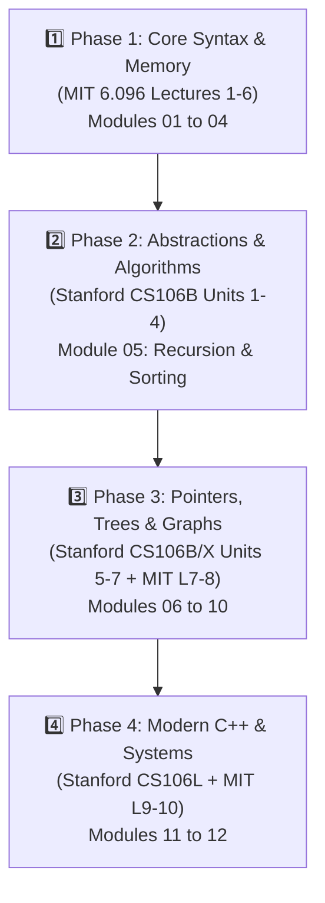

# 🏛️ Master Academic Guide & Comprehensive Curricula Analysis (`files/`)

> **Public Open-Source Guide to Four Landmark Computer Science Curricula in C++**  
> Integrated from **MIT 6.096**, **Stanford CS106B**, **Stanford CS106X**, and **Stanford CS106L**.

---

## 🎯 Vision & Purpose for Public Open-Source Learners

This directory houses the complete local academic material (lectures, assignments, solutions, projects, and textbooks) supporting this repository. 

Rather than relying on a single course or surface-level tutorial, this repository unifies **four world-class computer science curricula** into a progressive, step-by-step learning path. This master guide explains the differences between each course, their difficulty levels, target skill sets, and how to navigate them effectively.

---

## 📊 Course Comparison & Matrix

| Feature / Metric | 🏛️ MIT 6.096 | 🌲 Stanford CS106B | ⚡ Stanford CS106X | ⚙️ Stanford CS106L |
|------------------|---------------|-------------------|-------------------|-------------------|
| **Full Title** | *Introduction to C++* | *Programming Abstractions in C++* | *Accelerated Programming Abstractions* | *Standard C++ Programming* |
| **Institution** | MIT (IAP) | Stanford University | Stanford University | Stanford University |
| **Target Level** | **Beginner $\rightarrow$ Intermediate** | **Intermediate** | **Accelerated / Honors** | **Advanced / Modern Engineering** |
| **Primary Focus** | Syntax, GCC compilation, pointers, manual memory (`new`/`delete`), basic OOP | Abstract Data Types (ADTs), Recursion, Backtracking, Big-O, Trees, Graphs | High-performance ADTs, 4-Way PQueues, Dynamic Programming, Capstone Projects | Modern C++ (C++11/17/20), Move Semantics, RAII, Smart Pointers, Templates |
| **Prerequisites** | Basic programming concepts | Introductory programming | Strong background in algorithms/programming | CS106B or intermediate C++ knowledge |
| **Standard Used** | Classic / Modern C++ Basics | C++11 / Stanford C++ Libraries | C++11 / Stanford C++ Libraries | Modern C++11 / C++17 / C++20 |
| **Local Catalog** | 10 Lecture PDFs, 4 Assignments, Solutions, Final Project | Textbook (*Eric Roberts* PDF), Assignments 0–9, Sections 1–8, Libraries | 34 Official Handouts catalog, Life, Boggle, PQueue, Huffman, Stanford 123 | 17 Lecture PDFs, 3 Projects (`HashMap`, `WikiRacer`, `linked-list`) |

---

## 🔍 Detailed Course Differences & Pedagogical Approaches

### 1. 🏛️ MIT 6.096 — Low-Level Systems & Core Syntax
- **Path**: [`files/mit6096/`](mit6096/)
- **Syllabus Document**: 📄 [`mit6096/README.md`](mit6096/README.md)
- **Pedagogical Approach**: Bottom-up engineering approach. Teaches C++ from the ground up, starting with C-style primitives, header separation, manual memory allocation (`new`/`delete`), raw pointer arithmetic, and basic class hierarchies.
- **Why study this?**: Essential for building a solid mental model of how C++ code interacts with RAM, stack frames, heap allocation, and the GCC compiler pipeline.

---

### 2. 🌲 Stanford CS106B — Data Structures & Algorithmic Thinking (Standard Track)
- **Path**: [`files/cs106b/`](cs106b/)
- **Syllabus Document**: 📄 [`cs106b/README.md`](cs106b/README.md)
- **Pedagogical Approach**: Abstraction-driven computer science. Focuses on **how to solve complex computational problems** using custom and standard data structures without getting bogged down in low-level language quirks.
- **Why study this?**: The gold standard for learning **Recursion**, **Backtracking**, **Big-O Notation**, **Linked Lists**, **Binary Search Trees (BST)**, **Huffman Compression**, and **Graph Theory (BFS, DFS, Dijkstra, Kruskal)**.

---

### 3. ⚡ Stanford CS106X — Honors & Accelerated Performance (Honors Track)
- **Path**: [`files/cs106x/`](cs106x/)
- **Syllabus Document**: 📄 [`cs106x/README.md`](cs106x/README.md)
- **Pedagogical Approach**: High-performance software design. CS106X covers the entire CS106B curriculum at double speed across **34 official handouts**, adding honors challenges like 4-way priority queues, memoization, sparse string arrays, tries/lexicons, and the `Stanford 1-2-3` spreadsheet engine.
- **Why study this?**: Recommended for learners looking to push algorithmic efficiency and code optimization to professional competitive levels.

---

### 4. ⚙️ Stanford CS106L — Idiomatic Modern C++ Engineering
- **Path**: [`files/cs106l/`](cs106l/)
- **Syllabus Document**: 📄 [`cs106l/README.md`](cs106l/README.md)
- **Pedagogical Approach**: Modern C++ standards (C++11/17/20) and memory safety. Eliminates legacy C-style anti-patterns in favor of type safety, brace initialization `{}`, uniform streams, template container design, functional lambdas, Move Semantics (`std::move`), RAII, and Smart Pointers (`unique_ptr`, `shared_ptr`).
- **Why study this?**: Critical for writing production-grade C++ code that is leak-free, modern, thread-safe, and compatible with contemporary industry standards.

---

## 🚀 Recommended Open-Source Learning Roadmap

For a self-taught learner navigating this repository, we recommend following this 4-phase sequence:

---

## 🗺️ Master Module Alignment Map

Below is the master catalog mapping local academic files across all course directories to the 12 primary learning modules in this repository:

| # | Repository Module | Primary Course Source | Key Academic Files |
|---|-------------------|-----------------------|-------------------|
| **01** | [`01_GettingStarted`](../01_GettingStarted/) | MIT L1 / CS106L L1 | [`mit6096/lectures/Lecture01_Introduction.pdf`](mit6096/lectures/Lecture01_Introduction.pdf), [`cs106l/lectures/Welcome to C++!.pdf`](cs106l/lectures/Welcome%20to%20C++!.pdf) |
| **02** | [`02_BasicSyntax`](../02_BasicSyntax/) | MIT L2 / CS106L L2–3 | [`mit6096/lectures/Lecture02_FlowOfControl.pdf`](mit6096/lectures/Lecture02_FlowOfControl.pdf), [`cs106l/lectures/WL2-Structures.pdf`](cs106l/lectures/WL2-Structures.pdf) |
| **03** | [`03_Subroutines`](../03_Subroutines/) | MIT L3 / CS106L L3 | [`mit6096/lectures/Lecture03_Functions.pdf`](mit6096/lectures/Lecture03_Functions.pdf), [`cs106l/lectures/WLecture_3_Init_and_Ref.pdf`](cs106l/lectures/WLecture_3_Init_and_Ref.pdf) |
| **04** | [`04_ArraysStrings`](../04_ArraysStrings/) | MIT L4 / CS106L L4 | [`mit6096/lectures/Lecture04_ArraysAndStrings.pdf`](mit6096/lectures/Lecture04_ArraysAndStrings.pdf), [`cs106b/assignments/Assignment 1/`](cs106b/assignments/Assignment%201/) |
| **05** | [`05_RecursionAlgorithms`](../05_RecursionAlgorithms/) | Stanford CS106B / CS106X | [`cs106b/assignments/Assignment 3/`](cs106b/assignments/Assignment%203/), [`cs106b/textbook/CS106BX-Reader.pdf`](cs106b/textbook/CS106BX-Reader.pdf) |
| **06** | [`06_Pointers`](../06_Pointers/) | MIT L5 / CS106L L3, L11 | [`mit6096/lectures/Lecture05_Pointers.pdf`](mit6096/lectures/Lecture05_Pointers.pdf), [`cs106l/lectures/WL11_Const.pdf`](cs106l/lectures/WL11_Const.pdf) |
| **07** | [`07_Classes`](../07_Classes/) | MIT L6 / CS106L L2,10,12 | [`mit6096/lectures/Lecture06_Classes.pdf`](mit6096/lectures/Lecture06_Classes.pdf), [`cs106l/lectures/WL12_Operators.pdf`](cs106l/lectures/WL12_Operators.pdf) |
| **08** | [`08_OOP`](../08_OOP/) | MIT L7 / CS106L L10 | [`mit6096/lectures/Lecture07_OOP.pdf`](mit6096/lectures/Lecture07_OOP.pdf), [`mit6096/assignments/Assignment04.pdf`](mit6096/assignments/Assignment04.pdf) |
| **09** | [`09_MemoryManagement`](../09_MemoryManagement/) | MIT L8 / CS106L L13–15 | [`mit6096/lectures/Lecture08_MemoryManagement.pdf`](mit6096/lectures/Lecture08_MemoryManagement.pdf), [`cs106l/lectures/WL14-Move.pdf`](cs106l/lectures/WL14-Move.pdf), [`cs106l/lectures/WL15_RAII.pdf`](cs106l/lectures/WL15_RAII.pdf) |
| **10** | [`10_DataStructures`](../10_DataStructures/) | Stanford CS106B / CS106L | [`cs106b/assignments/Assignment 4/`](cs106b/assignments/Assignment%204/), [`cs106b/assignments/Assignment 6/`](cs106b/assignments/Assignment%206/), [`cs106l/assignments/HashMap/`](cs106l/assignments/HashMap/) |
| **11** | [`11_FileIO`](../11_FileIO/) | MIT L10 / CS106L L4 | [`cs106l/lectures/WL4_Streams.pdf`](cs106l/lectures/WL4_Streams.pdf), [`mit6096/lectures/Lecture10_AdvancedTopicsII.pdf`](mit6096/lectures/Lecture10_AdvancedTopicsII.pdf) |
| **12** | [`12_AdvancedCPP`](../12_AdvancedCPP/) | MIT L9–10 / CS106L L5–9 / Stanford X | [`cs106b/assignments/Assignment 5/`](cs106b/assignments/Assignment%205/), [`cs106l/assignments/WikiRacer/`](cs106l/assignments/WikiRacer/) |

---

## 🔗 Direct Syllabus Links

- 🏛️ [**MIT 6.096 Syllabus & PDF Analysis**](mit6096/README.md)
- 🌲 [**Stanford CS106B Syllabus & PDF Analysis**](cs106b/README.md)
- ⚡ [**Stanford CS106X Syllabus & PDF Analysis**](cs106x/README.md)
- ⚙️ [**Stanford CS106L Syllabus & PDF Analysis**](cs106l/README.md)
- 📋 [**Master Repository Syllabus (`SYLLABUS.md`)**](../SYLLABUS.md)

---
*MiniLux0 — Learning C++ Master Academic Guide*
